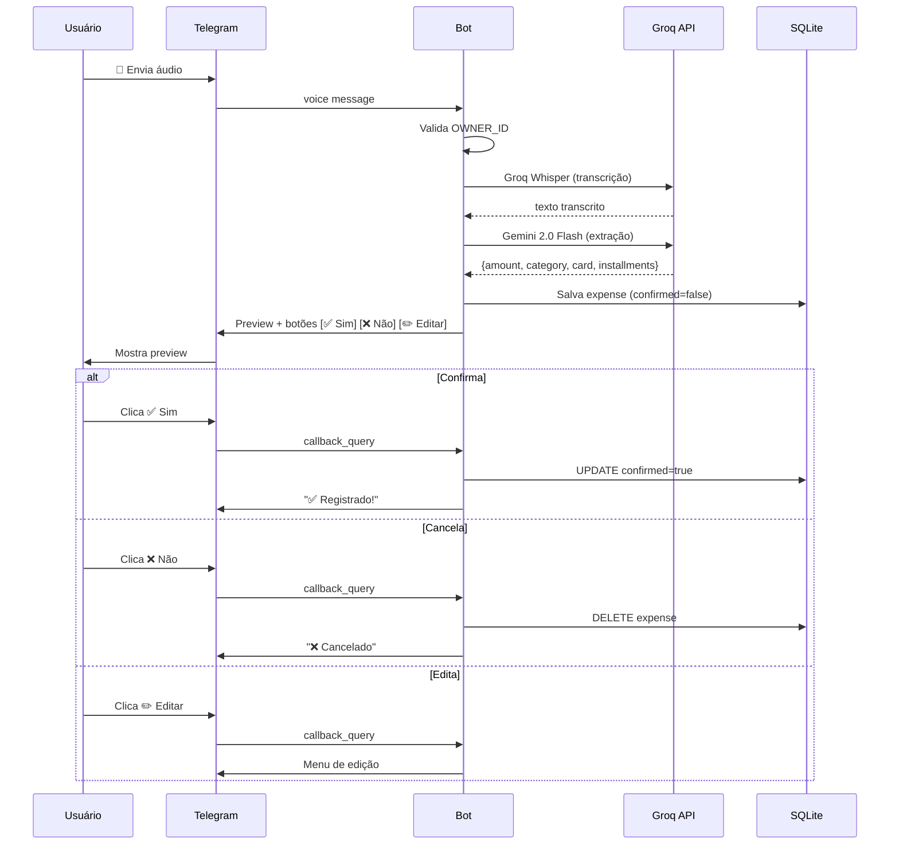
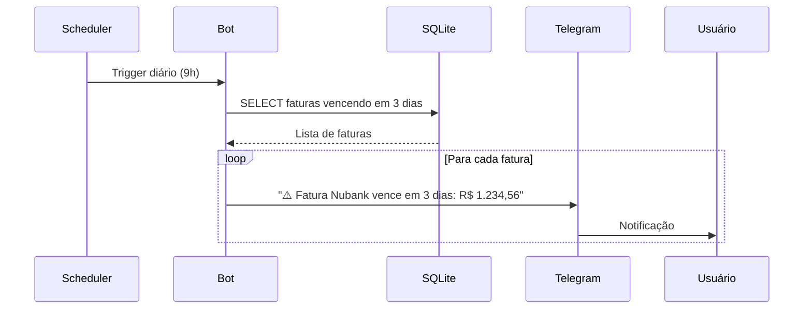

# FASE 2 — Arquitetura: Telegram Finance Bot

> **Status:** 🟡 Em andamento
> **Modo Cursor:** Plan

---

## 1. Stack Definida

| Camada | Tecnologia | Versão | Justificativa |
|--------|------------|--------|---------------|
| **Linguagem** | Python | 3.14 | Melhor ecossistema para bots/ML |
| **Bot Framework** | python-telegram-bot | 22.x | Async, bem mantido, tipado |
| **Speech-to-Text** | Groq Whisper Large v3 Turbo | API | Rápido, gratuito (limite generoso) |
| **LLM (Extração)** | Gemini 2.0 Flash | API | Rápido, tier free generoso, excelente qualidade |
| **Banco de Dados** | SQLite | 3.51.x | Local, zero config, suficiente para PESSOAL |
| **ORM** | SQLAlchemy | 2.0.x | Tipagem, migrations fáceis |
| **Migrations** | Alembic | 1.18.x | Integrado com SQLAlchemy |
| **Validação** | Pydantic | 2.12.x | Validação + serialização |
| **Env/Config** | python-dotenv | 1.2.x | Gerenciar secrets |

### Dependências de API (Custos)

| Serviço | Tier Free | Limite | Custo Excedente |
|---------|-----------|--------|-----------------|
| Groq API (Whisper) | ✅ Sim | ~14K req/dia | $0.05/1M tokens |
| Google AI (Gemini) | ✅ Sim | 15 RPM / 1M tokens/dia | Pay-as-you-go |
| Telegram Bot | ✅ Sim | Ilimitado | Gratuito |

> **Nota:** Para uso PESSOAL, os tiers free de Groq e Google AI são mais que suficientes.

---

## 2. Diagrama de Arquitetura

```
┌─────────────────────────────────────────────────────────────────┐
│                         TELEGRAM                                 │
│  ┌──────────┐                              ┌──────────────────┐ │
│  │  Usuário │ ─── áudio/texto ───────────▶ │   Telegram API   │ │
│  │  (Você)  │ ◀── confirmação/resposta ─── │                  │ │
│  └──────────┘                              └────────┬─────────┘ │
└────────────────────────────────────────────────────│────────────┘
                                                      │ webhook/polling
                                                      ▼
┌─────────────────────────────────────────────────────────────────┐
│                      BOT (Python)                               │
│                                                                  │
│  ┌──────────────┐    ┌──────────────┐    ┌──────────────────┐  │
│  │   Handlers   │───▶│   Services   │───▶│   Repository     │  │
│  │              │    │              │    │                  │  │
│  │ • /start     │    │ • AudioSvc   │    │ • ExpenseRepo    │  │
│  │ • /resumo    │    │ • ExpenseSvc │    │ • CardRepo       │  │
│  │ • /cartoes   │    │ • CardSvc    │    │ • CategoryRepo   │  │
│  │ • audio_msg  │    │ • AlertSvc   │    │                  │  │
│  │ • callback   │    │              │    │                  │  │
│  └──────────────┘    └──────┬───────┘    └────────┬─────────┘  │
│                              │                     │            │
│                              ▼                     ▼            │
│                    ┌──────────────┐      ┌──────────────────┐  │
│                    │   APIs IA    │      │     SQLite       │  │
│                    │              │      │                  │  │
│                    │ • Groq       │      │ • expenses       │  │
│                    │   (Whisper)  │      │ • cards          │  │
│                    │ • Gemini     │      │ • categories     │  │
│                    │   (Extração) │      │ • invoices       │  │
│                    └──────────────┘      └──────────────────┘  │
└─────────────────────────────────────────────────────────────────┘
```

---

## 3. Modelo de Dados

### 3.1 Diagrama ER

```
┌─────────────┐       ┌─────────────┐       ┌─────────────────┐
│   cards     │       │  expenses   │       │   categories    │
├─────────────┤       ├─────────────┤       ├─────────────────┤
│ id (PK)     │◀──┐   │ id (PK)     │   ┌──▶│ id (PK)         │
│ name        │   │   │ amount      │   │   │ name            │
│ last_digits │   │   │ description │   │   │ type (ENUM)     │
│ due_day     │   └───│ card_id(FK) │   │   │ icon            │
│ closing_day │       │ category_id │───┘   └─────────────────┘
│ is_credit   │       │ payment_type│
│ created_at  │       │ installments│       ┌─────────────────┐
└─────────────┘       │ current_inst│       │   invoices      │
                      │ expense_date│       ├─────────────────┤
                      │ created_at  │       │ id (PK)         │
                      │ confirmed   │       │ card_id (FK)    │
                      └─────────────┘       │ month           │
                                            │ year            │
                                            │ due_date        │
                                            │ total           │
                                            │ is_paid         │
                                            └─────────────────┘
```

### 3.2 Tabelas Detalhadas

#### `categories`

| Coluna | Tipo | Constraints | Descrição |
|--------|------|-------------|-----------|
| id | INTEGER | PK, AUTO | ID único |
| name | VARCHAR(50) | NOT NULL, UNIQUE | Nome da categoria |
| type | ENUM | NOT NULL | `ESSENCIAL` / `NAO_ESSENCIAL` |
| icon | VARCHAR(10) | NOT NULL | Emoji da categoria |

**Dados iniciais (seed):**
```sql
INSERT INTO categories (name, type, icon) VALUES
('Mercado', 'ESSENCIAL', '🛒'),
('Moradia', 'ESSENCIAL', '🏠'),
('Contas', 'ESSENCIAL', '💡'),
('Transporte', 'ESSENCIAL', '🚗'),
('Saúde', 'ESSENCIAL', '🏥'),
('Alimentação', 'NAO_ESSENCIAL', '🍔'),
('Lazer', 'NAO_ESSENCIAL', '🎮'),
('Vestuário', 'NAO_ESSENCIAL', '👕'),
('Outros', 'NAO_ESSENCIAL', '🎁');
```

#### `cards`

| Coluna | Tipo | Constraints | Descrição |
|--------|------|-------------|-----------|
| id | INTEGER | PK, AUTO | ID único |
| name | VARCHAR(50) | NOT NULL | Nome do cartão (ex: "Nubank") |
| last_digits | VARCHAR(4) | NULL | Últimos 4 dígitos |
| due_day | INTEGER | 1-31 | Dia do vencimento da fatura |
| closing_day | INTEGER | 1-31 | Dia do fechamento |
| is_credit | BOOLEAN | NOT NULL | Se é crédito (vs débito) |
| created_at | DATETIME | DEFAULT NOW | Data de criação |

#### `expenses`

| Coluna | Tipo | Constraints | Descrição |
|--------|------|-------------|-----------|
| id | INTEGER | PK, AUTO | ID único |
| amount | DECIMAL(10,2) | NOT NULL | Valor em reais |
| description | TEXT | NULL | Descrição original |
| card_id | INTEGER | FK → cards | Cartão usado |
| category_id | INTEGER | FK → categories | Categoria |
| payment_type | ENUM | NOT NULL | `PIX` / `DEBITO` / `CREDITO` |
| installments | INTEGER | DEFAULT 1 | Total de parcelas |
| current_installment | INTEGER | DEFAULT 1 | Parcela atual |
| expense_date | DATE | NOT NULL | Data do gasto |
| confirmed | BOOLEAN | DEFAULT FALSE | Se foi confirmado |
| created_at | DATETIME | DEFAULT NOW | Data de criação |

#### `invoices`

| Coluna | Tipo | Constraints | Descrição |
|--------|------|-------------|-----------|
| id | INTEGER | PK, AUTO | ID único |
| card_id | INTEGER | FK → cards | Cartão |
| month | INTEGER | 1-12 | Mês da fatura |
| year | INTEGER | NOT NULL | Ano da fatura |
| due_date | DATE | NOT NULL | Data de vencimento |
| total | DECIMAL(10,2) | DEFAULT 0 | Total calculado |
| is_paid | BOOLEAN | DEFAULT FALSE | Se foi paga |

---

## 4. Fluxos Principais

### 4.1 Registro de Gasto (Áudio)



### 4.2 Alerta de Vencimento



---

## 5. Comandos do Bot

| Comando | Descrição | Resposta |
|---------|-----------|----------|
| `/start` | Inicialização | Mensagem de boas-vindas + instruções |
| `/resumo` | Resumo do mês | Total por categoria, essencial vs não essencial |
| `/cartoes` | Listar cartões | Lista com próximos vencimentos |
| `/faturas` | Faturas abertas | Faturas pendentes por cartão |
| `/categorias` | Listar categorias | Categorias disponíveis |
| `/ajuda` | Ajuda | Comandos disponíveis |

---

## 6. Estrutura de Pastas do Projeto

```
telegram-finance-bot/
├── src/
│   ├── __init__.py
│   ├── main.py                 # Entry point
│   ├── config.py               # Configurações
│   ├── handlers/               # Telegram handlers
│   │   ├── __init__.py
│   │   ├── commands.py         # /start, /resumo, etc
│   │   ├── audio.py            # Processamento de áudio
│   │   └── callbacks.py        # Inline buttons
│   ├── services/               # Lógica de negócio
│   │   ├── __init__.py
│   │   ├── audio_service.py    # Transcrição + extração
│   │   ├── expense_service.py  # CRUD de gastos
│   │   ├── card_service.py     # CRUD de cartões
│   │   └── alert_service.py    # Alertas de vencimento
│   ├── repositories/           # Acesso a dados
│   │   ├── __init__.py
│   │   ├── expense_repo.py
│   │   ├── card_repo.py
│   │   └── category_repo.py
│   ├── models/                 # SQLAlchemy models
│   │   ├── __init__.py
│   │   ├── expense.py
│   │   ├── card.py
│   │   ├── category.py
│   │   └── invoice.py
│   ├── schemas/                # Pydantic schemas
│   │   ├── __init__.py
│   │   └── expense.py
│   └── utils/
│       ├── __init__.py
│       ├── groq_client.py      # Cliente Groq API (Whisper)
│       └── gemini_client.py    # Cliente Google AI (Gemini)
├── migrations/                 # Alembic migrations
│   └── versions/
├── tests/
│   └── ...
├── .env.example
├── .gitignore
├── alembic.ini
├── pyproject.toml
└── README.md
```

---

## 7. Variáveis de Ambiente

```env
# .env.example

# Telegram
TELEGRAM_BOT_TOKEN=your_bot_token_here
OWNER_TELEGRAM_ID=your_telegram_id_here

# Groq (Speech-to-Text)
GROQ_API_KEY=your_groq_api_key_here

# Google AI (Gemini)
GOOGLE_API_KEY=your_google_api_key_here

# Database
DATABASE_URL=sqlite:///./data/finance.db

# App
LOG_LEVEL=INFO
ALERT_HOUR=9
ALERT_DAYS_BEFORE=3
```

---

## 8. Decisões Arquiteturais (ADR)

### ADR-001: Usar APIs de IA na nuvem (Groq + Gemini)

**Contexto:** Precisamos de transcrição de áudio e extração de dados via LLM.

**Decisão:** Usar **Groq Whisper Large v3 Turbo** para STT e **Gemini 2.0 Flash** para extração.

**Justificativa:**
- ✅ Latência muito baixa em ambas APIs
- ✅ Tiers free generosos (Groq: 14K req/dia, Gemini: 15 RPM)
- ✅ Modelos de alta qualidade e especializados
- ✅ Sem necessidade de hardware local (100% cloud)
- ✅ Gemini Flash tem excelente custo-benefício para extração

**Alternativas descartadas:**
- Whisper local: requer GPU
- Ollama/Llama local: requer RAM/GPU
- OpenAI API: mais caro

---

### ADR-002: SQLite como banco de dados

**Contexto:** Precisa persistir dados financeiros.

**Decisão:** Usar SQLite com SQLAlchemy.

**Justificativa:**
- ✅ Zero configuração
- ✅ Arquivo único (fácil backup)
- ✅ Suficiente para 1 usuário
- ✅ ACID compliant
- ❌ Não escala (não precisa para PESSOAL)

**Alternativas consideradas:**
- PostgreSQL: overkill para uso pessoal
- JSON files: sem queries complexas

---

### ADR-003: Confirmação obrigatória antes de salvar

**Contexto:** LLM pode extrair dados incorretos.

**Decisão:** Sempre pedir confirmação com preview.

**Justificativa:**
- ✅ Evita registros incorretos
- ✅ Permite correção antes de salvar
- ✅ Transparência do que foi entendido
- ❌ Um clique extra (aceitável)

---

## Gate da FASE 2

- [x] Stack definida com versões
- [x] Diagrama de arquitetura
- [x] Modelo de dados completo
- [x] Fluxos principais documentados
- [x] Estrutura de pastas definida
- [x] ADRs registrados

✅ **FASE 2 COMPLETA** — Pronto para FASE 3

---

## Decisões pendentes para FASE 3

| Decisão | Opções | Impacto |
|---------|--------|---------|
| Prompt do LLM para extração | Definir na FASE 3 | Alto |
| Formato exato de confirmação | Definir na FASE 3 | Médio |
| Tratamento de parcelas | Como distribuir nas faturas? | Médio |
