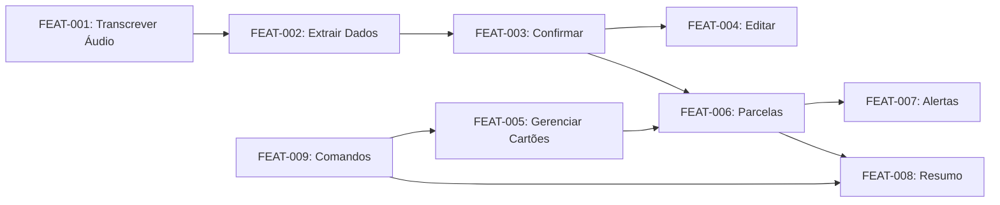

# PRD — Assistente Financeiro (Telegram)

> **Resumo executivo:** Assistente financeiro em grupo do Telegram para gestão pessoal via áudio.
> Identifica mensagens de voz enviadas no grupo, transcreve (Groq Whisper Large v3 Turbo), extrai dados estruturados (Gemini 2.0 Flash),
> persiste em SQLite com categorização automática (PIX, Débito, Crédito), parcelas calculadas pela data de fechamento dos cartões cadastrados,
> e classificação essencial vs não essencial. Perfil PESSOAL, uso local, único usuário.

## Objetivo final do usuário

**Ver o que estou gastando de essencial para minha vida e o que não é essencial.**

O assistente deve permitir registrar gastos por áudio, categorizar por forma de pagamento (PIX, Débito, Crédito), por categoria (mercado, saúde, educação, etc.) e por tipo (essencial / não essencial), extrair datas de frases como "comprei R$ 30 em cerveja ontem" ou "gastei 50 reais no iFood no sábado", e persistir tudo corretamente no banco. **Uma única mensagem de áudio com vários itens** (ex.: "gastei 25 reais em cerveja e 30 reais em carne") **deve virar dois lançamentos** — um essencial (carne) e um não essencial (cerveja). No MVP, o foco é **apenas o registro correto no banco**; um front-end para consumir esses dados virá depois.

## 1. Visão Geral

Assistente que opera em um **grupo do Telegram**: identifica mensagens de áudio enviadas no grupo e processa **apenas as do dono (OWNER)**. Transcreve o áudio, extrai automaticamente valor, categoria, método de pagamento (PIX, Débito, Crédito), data do gasto (incluindo expressões como "ontem", "sábado") e parcelas; para crédito, calcula as parcelas conforme a **data de fechamento dos cartões/créditos que você cadastrar**. Apresenta preview para confirmação e persiste no banco. Inclui gestão de vencimento das faturas dos cartões cadastrados com alertas.

## 2. Classificação do Projeto

- **Perfil:** PESSOAL
- **Justificativa:**
  - Usuários: 1 (apenas você)
  - Exposição: Local (sua máquina)
  - PII: Telegram ID + dados financeiros pessoais
  - SLA: Não aplicável
  - Impacto de falha: Baixo (inconveniência pessoal)

## 3. Objetivos e Não-Objetivos

### Objetivos (MVP)
- Registrar gastos via áudio com confirmação
- Categorizar automaticamente (10 categorias fixas, incluindo Educação)
- Classificar como ESSENCIAL ou NÃO ESSENCIAL
- Suportar PIX, débito e crédito
- Gerenciar parcelas de compras parceladas
- Alertar vencimento de faturas dos cartões/créditos cadastrados
- Permitir correção antes de salvar

### Não-Objetivos (fora do escopo no MVP)
- **Frontend web/mobile** — consumir os dados do banco (v2)
- Relatórios e gráficos (v2)
- Múltiplos usuários
- Integração com bancos (Open Finance)
- Exportação para Excel/CSV
- Reconhecimento de notas fiscais/imagens

## 4. Personas/Papéis

| Persona | Descrição | Permissões |
|---------|-----------|------------|
| OWNER | Único usuário (você) | Todas as operações |

**Validação:** O assistente DEVE processar apenas mensagens de áudio do OWNER; em grupo, ignora áudios de outros participantes.

## 5. User Stories

### FEAT-001: Receber e Transcrever Áudio

**Como** OWNER, **quero** enviar um áudio descrevendo meu gasto, **para** não precisar digitar.

#### Critérios de Aceite (Gherkin)

```gherkin
# Happy path 1: Áudio válido
Given eu envio um áudio de até 60 segundos
When o bot recebe a mensagem de voz
Then o bot baixa o arquivo de áudio
And envia para Groq Whisper Large v3 Turbo
And retorna o texto transcrito

# Happy path 2: Áudio curto
Given eu envio um áudio de 3 segundos dizendo "cinquenta reais de gasolina no débito"
When o bot processa
Then a transcrição retorna "cinquenta reais de gasolina no débito"

# Unhappy path 1: Áudio muito longo
Given eu envio um áudio de mais de 60 segundos
When o bot recebe
Then o bot responde "❌ Áudio muito longo. Máximo 60 segundos."
And não processa o áudio

# Unhappy path 2: Usuário não autorizado
Given um Telegram ID diferente do OWNER envia mensagem
When o bot recebe
Then o bot ignora silenciosamente (não responde)

# Unhappy path 3: Erro na API Groq
Given eu envio um áudio válido
When a API Groq retorna erro 503
Then o bot responde "❌ Erro ao transcrever. Tente novamente."
And loga o erro com traceId
```

#### Regras de Negócio
- RULE-001: Áudio DEVE ter no máximo 60 segundos
- RULE-002: Apenas OWNER_TELEGRAM_ID pode interagir
- RULE-003: Áudio é deletado após transcrição (não persistir)

#### Testes Associados
- TEST-001: Transcrição de áudio válido
- TEST-002: Rejeição de áudio longo
- TEST-003: Rejeição de usuário não autorizado
- TEST-004: Tratamento de erro da API Groq

---

### FEAT-002: Extrair Dados do Texto

**Como** OWNER, **quero** que o bot extraia automaticamente os dados do gasto, **para** não preencher manualmente.

#### Critérios de Aceite (Gherkin)

```gherkin
# Happy path 1: Extração completa
Given o texto transcrito é "gastei 150 reais no mercado no cartão nubank em 3 vezes"
When o LLM processa
Then extrai: { amount: 150.00, category: "Mercado", card: "Nubank", payment_type: "CREDITO", installments: 3 }

# Happy path 2: Extração com PIX
Given o texto é "paguei 50 reais de uber no pix"
When o LLM processa
Then extrai: { amount: 50.00, category: "Transporte", payment_type: "PIX", installments: 1 }

# Happy path 3: Categoria implícita
Given o texto é "almocei por 35 reais no débito"
When o LLM processa
Then extrai: { amount: 35.00, category: "Alimentação", payment_type: "DEBITO" }
And category_type é "NAO_ESSENCIAL"

# Happy path 4: Valor por extenso
Given o texto é "duzentos e cinquenta reais de conta de luz"
When o LLM processa
Then extrai: { amount: 250.00, category: "Contas" }

# Happy path 5: Um áudio com vários itens → DOIS lançamentos (essencial vs não essencial)
Given o texto transcrito é "gastei 25 reais em cerveja e 30 reais em carne"
When o LLM processa
Then extrai DOIS registros (dois lançamentos no banco):
  - { amount: 25.00, category: "Mercado", item: "cerveja", category_type: "NAO_ESSENCIAL" }
  - { amount: 30.00, category: "Mercado", item: "carne", category_type: "ESSENCIAL" }
And o bot mostra preview com os dois itens separados
And ao confirmar, persiste DOIS registros na base (um por item)

# Happy path 5b: Múltiplos itens — mesma ideia, outra redação
Given o texto é "fui no mercado e comprei 20 reais de cerveja e 15 reais de carne"
When o LLM processa
Then extrai DOIS registros:
  - { amount: 20.00, category: "Mercado", item: "cerveja", category_type: "NAO_ESSENCIAL" }
  - { amount: 15.00, category: "Mercado", item: "carne", category_type: "ESSENCIAL" }
And o bot mostra preview com os dois itens separados

# Happy path 6: Data relativa - ontem (ex.: "comprei R$ 30 em cerveja ontem")
Given hoje é 29/01/2026
And o texto é "comprei 30 reais em cerveja ontem"
When o LLM processa
Then extrai: { amount: 30.00, category: "Mercado", item: "cerveja", category_type: "NAO_ESSENCIAL", expense_date: "2026-01-28" }

# Happy path 6b: Data relativa - ontem (genérico)
Given hoje é 29/01/2026
And o texto é "gastei 50 reais ontem no mercado"
When o LLM processa
Then extrai: { amount: 50.00, expense_date: "2026-01-28" }

# Happy path 7: Data relativa - dia da semana (ex.: "gastei 50 reais no iFood no sábado")
Given hoje é quarta-feira 29/01/2026
And o texto é "gastei 50 reais no iFood no sábado"
When o LLM processa
Then extrai: { amount: 50.00, category: "Alimentação", item: "iFood", expense_date: "2026-01-25" }

# Happy path 7b: Data relativa - dia da semana (genérico)
Given hoje é quarta-feira 29/01/2026
And o texto é "comprei 100 reais de gasolina na segunda"
When o LLM processa
Then extrai: { amount: 100.00, expense_date: "2026-01-27" }

# Happy path 8: Data relativa - anteontem
Given hoje é 29/01/2026
And o texto é "paguei 200 reais de conta anteontem"
When o LLM processa
Then extrai: { amount: 200.00, expense_date: "2026-01-27" }

# Happy path 9: Sem data mencionada
Given hoje é 29/01/2026
And o texto é "gastei 50 reais no mercado"
When o LLM processa
Then extrai: { expense_date: "2026-01-29" } (data atual)

# Unhappy path 1: Valor não identificado
Given o texto é "comprei uma coisa no mercado"
When o LLM processa
Then extrai: { amount: null, category: "Mercado" }
And o bot pede: "💰 Qual foi o valor?"

# Unhappy path 2: Texto incompreensível
Given o texto é "asdfghjkl zxcvbnm"
When o LLM processa
Then o bot responde: "❓ Não entendi. Pode repetir o gasto?"
```

#### Regras de Negócio
- RULE-004: Valor DEVE ser extraído ou solicitado
- RULE-005: Categoria DEVE ser uma das 10 definidas (inclui Educação)
- RULE-006: Se categoria não identificada, usar "Outros"
- RULE-007: Se cartão não identificado e payment_type=CREDITO, perguntar qual cartão
- RULE-008: Parcelas default = 1 se não mencionado
- RULE-029: **Múltiplos itens** em uma única mensagem de áudio DEVEM virar **dois (ou mais) lançamentos** no banco — um registro por item (ex.: "gastei 25 em cerveja e 30 em carne" → dois lançamentos).
- RULE-030: **Cada item** determina ESSENCIAL ou NÃO ESSENCIAL (ex.: cerveja → NÃO ESSENCIAL, carne → ESSENCIAL); por isso itens diferentes na mesma frase geram lançamentos separados.
- RULE-031: **Datas relativas** DEVEM ser convertidas para data absoluta
- RULE-032: Se **data não mencionada**, usar data atual

#### Classificação de Itens (ESSENCIAL vs NÃO ESSENCIAL)

| Item | Classificação | Categoria |
|------|---------------|-----------|
| Carne, frango, peixe, ovos | ESSENCIAL | Mercado |
| Arroz, feijão, macarrão, pão | ESSENCIAL | Mercado |
| Frutas, verduras, legumes | ESSENCIAL | Mercado |
| Leite, queijo, manteiga | ESSENCIAL | Mercado |
| Cerveja, vinho, destilados | NÃO ESSENCIAL | Mercado |
| Refrigerante, suco industrializado | NÃO ESSENCIAL | Mercado |
| Doces, chocolates, sorvete | NÃO ESSENCIAL | Mercado |
| Salgadinhos, snacks | NÃO ESSENCIAL | Mercado |
| Produtos de limpeza | ESSENCIAL | Mercado |
| Higiene pessoal | ESSENCIAL | Mercado |

> **Nota:** O LLM deve inferir a classificação baseado no item mencionado. Se não for possível determinar, usar a classificação padrão da categoria.

#### Mapeamento de Datas Relativas

| Expressão | Cálculo |
|-----------|---------|
| "hoje" | data atual |
| "ontem" | data atual - 1 dia |
| "anteontem" | data atual - 2 dias |
| "semana passada" | data atual - 7 dias |
| "segunda", "terça", etc. | último dia da semana mencionado |
| "dia X" (ex: "dia 15") | dia X do mês atual (ou anterior se já passou) |

#### Prompt de Extração (LLM)

```
Você é um assistente de extração de dados financeiros.
Data de hoje: {data_atual}

Extraia do texto os seguintes campos em JSON. Se houver MÚLTIPLOS ITENS com valores separados, retorne um ARRAY de objetos.

Para CADA item/gasto:
- amount: valor em reais (número decimal, null se não encontrado)
- category: uma de [Mercado, Moradia, Contas, Transporte, Saúde, Educação, Alimentação, Lazer, Vestuário, Outros]
- category_type: ESSENCIAL ou NAO_ESSENCIAL (baseado no ITEM específico, não na categoria)
- item: nome do item comprado (se mencionado)
- card: nome do cartão se mencionado (null se não)
- payment_type: PIX | DEBITO | CREDITO (inferir pelo contexto)
- installments: número de parcelas (1 se não mencionado)
- expense_date: data do gasto em formato YYYY-MM-DD
- description: descrição curta do gasto

Regras de classificação de itens:
- Alimentos básicos (carne, arroz, feijão, frutas, verduras, pão, leite) → ESSENCIAL
- Bebidas alcoólicas (cerveja, vinho, whisky) → NAO_ESSENCIAL
- Doces, refrigerantes, snacks → NAO_ESSENCIAL
- Produtos de limpeza e higiene → ESSENCIAL

Regras de data:
- "ontem" = {data_atual} - 1 dia
- "anteontem" = {data_atual} - 2 dias
- "segunda/terça/etc" = último dia da semana mencionado
- Se não mencionar data, usar {data_atual}

Texto: "{texto}"

Se houver múltiplos itens com valores diferentes, retorne: { "items": [...] }
Se for um único gasto, retorne o objeto diretamente.
Responda APENAS com JSON válido, sem explicações.
```

#### Testes Associados
- TEST-005: Extração completa com todos os campos
- TEST-006: Extração com PIX
- TEST-007: Inferência de categoria
- TEST-008: Valor por extenso
- TEST-009: Solicitação de valor faltante
- TEST-010: Texto incompreensível
- TEST-039: Múltiplos itens na mesma compra
- TEST-040: Classificação de itens (cerveja vs carne)
- TEST-041: Data relativa "ontem"
- TEST-042: Data relativa dia da semana
- TEST-043: Data relativa "anteontem"
- TEST-044: Data não mencionada usa atual

---

### FEAT-003: Confirmar Registro

**Como** OWNER, **quero** ver um preview antes de salvar, **para** corrigir erros de extração.

#### Critérios de Aceite (Gherkin)

```gherkin
# Happy path 1: Confirmação de item único
Given o bot extraiu { amount: 150, category: "Mercado", card: "Nubank", payment_type: "CREDITO", installments: 3 }
When mostra o preview
Then exibe:
  "💰 R$ 150,00
   📁 Mercado (ESSENCIAL)
   💳 Nubank - Crédito 3x (R$ 50,00/parcela)
   📅 29/01/2026
   
   Confirmar?"
And mostra botões [✅ Sim] [❌ Não] [✏️ Editar]

# Happy path 2: Confirmação de múltiplos itens
Given o bot extraiu dois itens:
  - { amount: 20, item: "cerveja", category_type: "NAO_ESSENCIAL" }
  - { amount: 15, item: "carne", category_type: "ESSENCIAL" }
When mostra o preview
Then exibe:
  "🛒 Compra no Mercado - 29/01/2026
   
   ❌ Cerveja: R$ 20,00 (NÃO ESSENCIAL)
   ✅ Carne: R$ 15,00 (ESSENCIAL)
   ─────────────────
   💰 Total: R$ 35,00
   💳 Débito
   
   Confirmar ambos?"
And mostra botões [✅ Confirmar Todos] [❌ Cancelar] [✏️ Editar]

# Happy path 3: Usuário confirma
Given o preview está exibido
When usuário clica [✅ Sim] ou [✅ Confirmar Todos]
Then o(s) gasto(s) é(são) salvo(s) no banco com confirmed=true
And bot responde "✅ Registrado!" ou "✅ 2 itens registrados!"

# Happy path 4: Usuário cancela
Given o preview está exibido
When usuário clica [❌ Não] ou [❌ Cancelar]
Then o(s) registro(s) pendente(s) é(são) deletado(s)
And bot responde "❌ Cancelado"

# Happy path 5: Usuário edita item específico (múltiplos)
Given o preview de múltiplos itens está exibido
When usuário clica [✏️ Editar]
Then bot mostra:
  "Qual item deseja editar?
   [1️⃣ Cerveja R$20] [2️⃣ Carne R$15] [🔙 Voltar]"

# Happy path 6: Usuário edita
Given o preview está exibido
When usuário clica [✏️ Editar]
Then bot mostra menu:
  "O que deseja editar?
   [💰 Valor] [📁 Categoria] [💳 Cartão] [🔢 Parcelas] [📅 Data]"

# Unhappy path 1: Timeout de confirmação
Given o preview está exibido há mais de 5 minutos
When usuário não responde
Then o registro pendente é deletado automaticamente
And bot responde "⏰ Tempo expirado. Registro cancelado."
```

#### Regras de Negócio
- RULE-009: Preview DEVE mostrar todos os dados extraídos
- RULE-010: Preview DEVE mostrar valor da parcela se parcelado
- RULE-011: Timeout de confirmação = 5 minutos
- RULE-012: Registro só é efetivado após confirmação

#### Testes Associados
- TEST-011: Exibição de preview completo
- TEST-012: Confirmação salva no banco
- TEST-013: Cancelamento deleta registro
- TEST-014: Edição de campo específico
- TEST-015: Timeout cancela automaticamente

---

### FEAT-004: Editar Dados Extraídos

**Como** OWNER, **quero** corrigir dados antes de confirmar, **para** garantir precisão.

#### Critérios de Aceite (Gherkin)

```gherkin
# Happy path 1: Editar valor
Given o preview mostra R$ 150,00
When usuário clica [💰 Valor]
Then bot pergunta "💰 Qual o valor correto?"
When usuário digita "180"
Then preview é atualizado para R$ 180,00

# Happy path 2: Editar categoria
Given o preview mostra "Alimentação"
When usuário clica [📁 Categoria]
Then bot mostra lista de categorias como botões
When usuário clica "Lazer"
Then preview é atualizado para "Lazer (NÃO ESSENCIAL)"

# Happy path 3: Editar cartão
Given o preview mostra "Nubank"
When usuário clica [💳 Cartão]
Then bot mostra lista dos 4 cartões cadastrados
When usuário clica "Inter"
Then preview é atualizado

# Happy path 4: Editar parcelas
Given o preview mostra "3x"
When usuário clica [🔢 Parcelas]
Then bot pergunta "🔢 Quantas parcelas?"
When usuário digita "6"
Then preview é atualizado para "6x (R$ 25,00/parcela)"
```

#### Regras de Negócio
- RULE-013: Valor editado DEVE ser > 0
- RULE-014: Categoria editada DEVE ser uma das 10 válidas
- RULE-015: Cartão editado DEVE estar cadastrado
- RULE-016: Parcelas editadas DEVEM ser entre 1 e 48

#### Testes Associados
- TEST-016: Edição de valor
- TEST-017: Edição de categoria
- TEST-018: Edição de cartão
- TEST-019: Edição de parcelas

---

### FEAT-005: Gerenciar Cartões e Créditos

**Como** OWNER, **quero** cadastrar meus cartões e linhas de crédito com **dia de fechamento** e vencimento, **para** o assistente calcular em qual fatura cada parcela entra.

#### Critérios de Aceite (Gherkin)

```gherkin
# Happy path 1: Listar cartões
Given existem cartões/créditos cadastrados
When usuário envia /cartoes
Then bot lista:
  "💳 Seus cartões/créditos:
   1. Nubank - Vence dia 10 (fecha dia 3)
   2. Inter - Vence dia 15 (fecha dia 8)
   3. C6 - Vence dia 20 (fecha dia 13)
   4. Itaú - Vence dia 5 (fecha dia 28)
   
   [➕ Adicionar] [✏️ Editar] [🗑️ Remover]"

# Happy path 2: Adicionar cartão
Given usuário clica [➕ Adicionar]
When bot pergunta "Nome do cartão?"
And usuário responde "Santander"
And bot pergunta "Dia do vencimento (1-31)?"
And usuário responde "12"
And bot pergunta "Dia do fechamento (1-31)?"
And usuário responde "5"
Then cartão é salvo
And bot confirma "✅ Cartão Santander adicionado!"

# Unhappy path 1: Limite de cartões
Given já existem 10 cartões cadastrados
When usuário tenta adicionar outro
Then bot responde "❌ Limite de 10 cartões atingido."
```

#### Regras de Negócio
- RULE-017: Máximo de 10 cartões
- RULE-018: Vencimento e fechamento DEVEM ser entre 1 e 31
- RULE-019: Nome do cartão DEVE ser único

#### Testes Associados
- TEST-020: Listar cartões
- TEST-021: Adicionar cartão
- TEST-022: Editar cartão
- TEST-023: Remover cartão
- TEST-024: Limite de cartões

---

### FEAT-006: Gestão de Parcelas nas Faturas

**Como** OWNER, **quero** que parcelas sejam distribuídas nas faturas corretas, **para** saber quanto vou pagar por mês.

#### Lógica de Fechamento e Vencimento

```
Exemplo de cartão:
- Fechamento: dia 20
- Vencimento: dia 28 (8 dias após fechamento)

Timeline:
|-------- FATURA JANEIRO --------|-------- FATURA FEVEREIRO --------|
[01/01]...[20/01 FECHA]...[28/01 VENCE]...[20/02 FECHA]...[28/02 VENCE]
          ↑                                ↑
     Compras até aqui                 Compras até aqui
     entram em JAN                    entram em FEV
```

#### Critérios de Aceite (Gherkin)

```gherkin
# Happy path 1: Compra ANTES do fechamento - parcela 1 no mês atual
Given hoje é 15/01/2026 (antes do fechamento)
And cartão Nubank fecha dia 20 e vence dia 28
When registro gasto de R$ 300 em 3x no Nubank
Then parcela 1/3 (R$ 100) vai para fatura JANEIRO/2026 (vence 28/01)
And parcela 2/3 (R$ 100) vai para fatura FEVEREIRO/2026 (vence 28/02)
And parcela 3/3 (R$ 100) vai para fatura MARÇO/2026 (vence 28/03)

# Happy path 2: Compra DEPOIS do fechamento - parcela 1 no próximo mês
Given hoje é 25/01/2026 (depois do fechamento dia 20)
And cartão Nubank fecha dia 20 e vence dia 28
When registro gasto de R$ 300 em 3x no Nubank
Then parcela 1/3 (R$ 100) vai para fatura FEVEREIRO/2026 (vence 28/02)
And parcela 2/3 (R$ 100) vai para fatura MARÇO/2026 (vence 28/03)
And parcela 3/3 (R$ 100) vai para fatura ABRIL/2026 (vence 28/04)

# Happy path 3: Compra NO DIA do fechamento - entra na fatura atual
Given hoje é 20/01/2026 (dia do fechamento)
And cartão Nubank fecha dia 20
When registro gasto no Nubank
Then gasto vai para fatura JANEIRO/2026 (fatura atual)

# Happy path 4: Compra à vista (1x) antes do fechamento
Given hoje é 10/01/2026
And cartão fecha dia 20
When registro gasto de R$ 150 em 1x
Then gasto vai para fatura JANEIRO/2026

# Happy path 5: Compra à vista (1x) depois do fechamento
Given hoje é 22/01/2026
And cartão fecha dia 20
When registro gasto de R$ 150 em 1x
Then gasto vai para fatura FEVEREIRO/2026

# Happy path 6: Virada de ano
Given hoje é 28/12/2025 (depois do fechamento dia 20)
And cartão fecha dia 20 e vence dia 28
When registro gasto de R$ 200 em 2x
Then parcela 1/2 (R$ 100) vai para fatura JANEIRO/2026
And parcela 2/2 (R$ 100) vai para fatura FEVEREIRO/2026

# Happy path 7: Múltiplas parcelas longas
Given hoje é 15/01/2026 (antes do fechamento)
And cartão fecha dia 20
When registro gasto de R$ 1200 em 12x
Then parcela 1/12 vai para fatura JANEIRO/2026
And parcela 6/12 vai para fatura JUNHO/2026
And parcela 12/12 vai para fatura DEZEMBRO/2026
```

#### Regras de Negócio
- RULE-020: Compra **até o dia do fechamento** (inclusive) → entra na **fatura atual**
- RULE-021: Compra **após o dia do fechamento** → entra na **próxima fatura**
- RULE-022: **Parcela 1** segue a regra de fechamento (atual ou próxima)
- RULE-033: **Parcelas 2, 3, 4...** entram nas **faturas dos meses seguintes** à parcela 1
- RULE-034: Valor da parcela = valor total / número de parcelas (arredondado em centavos)
- RULE-035: Diferença de arredondamento vai na **última parcela**

#### Exemplo Completo

```
Compra: R$ 100,00 em 3x no cartão Nubank
Data da compra: 25/01/2026
Cartão: Fecha dia 20, Vence dia 28

Como 25 > 20 (após fechamento):
  → Parcela 1 entra em FEVEREIRO/2026

Distribuição:
┌──────────┬─────────┬────────────┬────────────┐
│ Parcela  │ Valor   │ Fatura     │ Vencimento │
├──────────┼─────────┼────────────┼────────────┤
│ 1/3      │ R$33,33 │ FEV/2026   │ 28/02/2026 │
│ 2/3      │ R$33,33 │ MAR/2026   │ 28/03/2026 │
│ 3/3      │ R$33,34 │ ABR/2026   │ 28/04/2026 │
└──────────┴─────────┴────────────┴────────────┘
                       ↑ centavo extra na última
```

#### Testes Associados
- TEST-025: Compra antes do fechamento - parcela 1 no mês atual
- TEST-026: Compra após fechamento - parcela 1 no próximo mês
- TEST-027: Compra no dia do fechamento
- TEST-045: Distribuição correta de 12 parcelas
- TEST-046: Arredondamento de centavos na última parcela
- TEST-047: Virada de ano (dezembro → janeiro)

---

### FEAT-007: Alertas de Vencimento

**Como** OWNER, **quero** ser alertado sobre faturas próximas do vencimento, **para** não esquecer de pagar.

#### Critérios de Aceite (Gherkin)

```gherkin
# Happy path 1: Alerta 3 dias antes
Given fatura do Nubank vence em 10/02/2026
And hoje é 07/02/2026 às 9h
When scheduler executa
Then bot envia:
  "⚠️ Fatura Nubank vence em 3 dias!
   💰 Total: R$ 1.234,56
   📅 Vencimento: 10/02/2026
   
   [✅ Marcar como paga]"

# Happy path 2: Marcar como paga
Given alerta de fatura exibido
When usuário clica [✅ Marcar como paga]
Then fatura.is_paid = true
And bot confirma "✅ Fatura marcada como paga!"

# Happy path 3: Alerta no dia
Given fatura vence hoje
When scheduler executa às 9h
Then bot envia "🚨 Fatura Nubank vence HOJE! R$ 1.234,56"
```

#### Regras de Negócio
- RULE-023: Alertar 3 dias antes e no dia do vencimento
- RULE-024: Alertas enviados às 9h
- RULE-025: Não alertar faturas já pagas

#### Testes Associados
- TEST-028: Alerta 3 dias antes
- TEST-029: Alerta no dia
- TEST-030: Marcar como paga
- TEST-031: Não alertar fatura paga

---

### FEAT-008: Resumo Financeiro

**Como** OWNER, **quero** ver um resumo dos gastos do mês, **para** acompanhar minhas finanças.

#### Critérios de Aceite (Gherkin)

```gherkin
# Happy path 1: Resumo do mês atual
Given existem gastos em janeiro/2026
When usuário envia /resumo
Then bot exibe:
  "📊 Resumo Janeiro/2026
   
   💰 Total: R$ 3.450,00
   
   ✅ ESSENCIAL: R$ 2.100,00 (61%)
   • Mercado: R$ 800,00
   • Contas: R$ 650,00
   • Transporte: R$ 400,00
   • Moradia: R$ 250,00
   
   ❌ NÃO ESSENCIAL: R$ 1.350,00 (39%)
   • Alimentação: R$ 600,00
   • Lazer: R$ 500,00
   • Vestuário: R$ 250,00
   
   💳 Por cartão:
   • Nubank: R$ 1.500,00
   • Inter: R$ 800,00
   • PIX: R$ 650,00
   • Débito: R$ 500,00"

# Happy path 2: Resumo de mês específico
Given usuário envia /resumo 12/2025
Then bot exibe resumo de dezembro/2025
```

#### Regras de Negócio
- RULE-026: Resumo agrupa por categoria e tipo (ESSENCIAL/NÃO ESSENCIAL)
- RULE-027: Resumo mostra percentual de cada tipo
- RULE-028: Resumo inclui gastos por método de pagamento

#### Testes Associados
- TEST-032: Resumo do mês atual
- TEST-033: Resumo de mês específico
- TEST-034: Resumo com zero gastos

---

### FEAT-009: Comandos Básicos

**Como** OWNER, **quero** comandos para interagir com o bot, **para** acessar funcionalidades.

#### Comandos

| Comando | Descrição | Resposta |
|---------|-----------|----------|
| `/start` | Inicialização | Boas-vindas + instruções |
| `/ajuda` | Lista de comandos | Todos os comandos disponíveis |
| `/resumo` | Resumo do mês | FEAT-008 |
| `/resumo MM/YYYY` | Resumo de mês específico | FEAT-008 |
| `/cartoes` | Gerenciar cartões | FEAT-005 |
| `/faturas` | Faturas abertas | Lista de faturas pendentes |
| `/categorias` | Lista de categorias | 10 categorias com ícones |

#### Testes Associados
- TEST-035: Comando /start
- TEST-036: Comando /ajuda
- TEST-037: Comando /categorias
- TEST-038: Comando /faturas

---

## 6. Grafo de Dependências



**Ordem de implementação:**
1. FEAT-009 (comandos básicos)
2. FEAT-005 (cartões)
3. FEAT-001 (transcrição)
4. FEAT-002 (extração)
5. FEAT-003 (confirmação)
6. FEAT-004 (edição)
7. FEAT-006 (parcelas)
8. FEAT-007 (alertas)
9. FEAT-008 (resumo)

## 7. Regras de Negócio Consolidadas

| ID | Regra | Features | Erro se violada |
|----|-------|----------|-----------------|
| RULE-001 | Áudio máx 60s | FEAT-001 | AUDIO.TOO_LONG |
| RULE-002 | Apenas OWNER_ID | FEAT-001 | (silencioso) |
| RULE-003 | Áudio deletado após uso | FEAT-001 | - |
| RULE-004 | Valor obrigatório | FEAT-002 | EXPENSE.MISSING_AMOUNT |
| RULE-005 | Categoria válida | FEAT-002 | - (usa "Outros") |
| RULE-006 | Categoria default "Outros" | FEAT-002 | - |
| RULE-007 | Cartão obrigatório se crédito | FEAT-002 | EXPENSE.MISSING_CARD |
| RULE-008 | Parcelas default 1 | FEAT-002 | - |
| RULE-009 | Preview mostra tudo | FEAT-003 | - |
| RULE-010 | Preview mostra valor parcela | FEAT-003 | - |
| RULE-011 | Timeout 5 min | FEAT-003 | EXPENSE.TIMEOUT |
| RULE-012 | Registro só após confirmar | FEAT-003 | - |
| RULE-013 | Valor > 0 | FEAT-004 | VALIDATION.INVALID_AMOUNT |
| RULE-014 | Categoria em lista | FEAT-004 | VALIDATION.INVALID_CATEGORY |
| RULE-015 | Cartão cadastrado | FEAT-004 | VALIDATION.INVALID_CARD |
| RULE-016 | Parcelas 1-48 | FEAT-004 | VALIDATION.INVALID_INSTALLMENTS |
| RULE-017 | Máx 10 cartões | FEAT-005 | CARD.LIMIT_REACHED |
| RULE-018 | Dia 1-31 | FEAT-005 | VALIDATION.INVALID_DAY |
| RULE-019 | Nome cartão único | FEAT-005 | CARD.NAME_TAKEN |
| RULE-020 | Até fechamento (inclusive) → fatura atual | FEAT-006 | - |
| RULE-021 | Após fechamento → próxima fatura | FEAT-006 | - |
| RULE-022 | Parcela 1 segue regra de fechamento | FEAT-006 | - |
| RULE-033 | Parcelas 2+ → meses seguintes à parcela 1 | FEAT-006 | - |
| RULE-034 | Valor parcela = total / n (arredondado) | FEAT-006 | - |
| RULE-035 | Diferença de arredondamento → última parcela | FEAT-006 | - |
| RULE-023 | Alertar 3 dias antes + no dia | FEAT-007 | - |
| RULE-024 | Alertas às 9h | FEAT-007 | - |
| RULE-025 | Não alertar fatura paga | FEAT-007 | - |
| RULE-026 | Resumo agrupa por categoria | FEAT-008 | - |
| RULE-027 | Resumo mostra % | FEAT-008 | - |
| RULE-028 | Resumo por método pagamento | FEAT-008 | - |
| RULE-029 | **Múltiplos itens separados** | FEAT-002 | - |
| RULE-030 | **Item determina ESSENCIAL/NÃO ESSENCIAL** | FEAT-002 | - |
| RULE-031 | **Datas relativas convertidas** | FEAT-002 | - |
| RULE-032 | **Sem data = data atual** | FEAT-002 | - |

## 8. Mapa de Erros

| Code | Severity | Quando ocorre | Resposta ao usuário |
|------|----------|---------------|---------------------|
| AUDIO.TOO_LONG | WARNING | Áudio > 60s | "❌ Áudio muito longo. Máximo 60 segundos." |
| AUDIO.TRANSCRIPTION_FAILED | ERROR | Erro Groq Whisper | "❌ Erro ao transcrever. Tente novamente." |
| EXPENSE.EXTRACTION_FAILED | ERROR | Erro Gemini API | "❌ Erro ao processar. Tente novamente." |
| EXPENSE.MISSING_AMOUNT | WARNING | Valor não extraído | "💰 Qual foi o valor?" |
| EXPENSE.MISSING_CARD | WARNING | Cartão não identificado (crédito) | "💳 Qual cartão foi usado?" |
| EXPENSE.TIMEOUT | INFO | Timeout de confirmação | "⏰ Tempo expirado. Registro cancelado." |
| EXPENSE.INCOMPREHENSIBLE | WARNING | Texto sem sentido | "❓ Não entendi. Pode repetir o gasto?" |
| VALIDATION.INVALID_AMOUNT | WARNING | Valor <= 0 | "❌ Valor deve ser maior que zero." |
| VALIDATION.INVALID_CATEGORY | WARNING | Categoria inválida | "❌ Categoria inválida." |
| VALIDATION.INVALID_CARD | WARNING | Cartão não cadastrado | "❌ Cartão não encontrado." |
| VALIDATION.INVALID_INSTALLMENTS | WARNING | Parcelas fora de 1-48 | "❌ Parcelas devem ser entre 1 e 48." |
| VALIDATION.INVALID_DAY | WARNING | Dia fora de 1-31 | "❌ Dia deve ser entre 1 e 31." |
| CARD.LIMIT_REACHED | WARNING | > 10 cartões | "❌ Limite de 10 cartões atingido." |
| CARD.NAME_TAKEN | WARNING | Nome duplicado | "❌ Já existe um cartão com este nome." |
| INTERNAL.ERROR | CRITICAL | Erro inesperado | "❌ Erro interno. Tente novamente." |

## 9. Métricas de Sucesso

| Métrica | Target | Como medir |
|---------|--------|------------|
| Taxa de transcrição correta | > 90% | Amostragem manual |
| Taxa de extração correta | > 85% | Comparar extração vs confirmado |
| Tempo de resposta (transcrição + extração) | < 5s | Log de latência |
| Gastos registrados/mês | > 30 | COUNT no banco |
| Faturas pagas no prazo | 100% | Alertas vs pagamentos |

## 10. Categorias

| ID | Categoria | Tipo | Ícone |
|----|-----------|------|-------|
| 1 | Mercado | ESSENCIAL | 🛒 |
| 2 | Moradia | ESSENCIAL | 🏠 |
| 3 | Contas | ESSENCIAL | 💡 |
| 4 | Transporte | ESSENCIAL | 🚗 |
| 5 | Saúde | ESSENCIAL | 🏥 |
| 6 | Educação | ESSENCIAL | 📚 |
| 7 | Alimentação | NÃO ESSENCIAL | 🍔 |
| 8 | Lazer | NÃO ESSENCIAL | 🎮 |
| 9 | Vestuário | NÃO ESSENCIAL | 👕 |
| 10 | Outros | NÃO ESSENCIAL | 🎁 |
