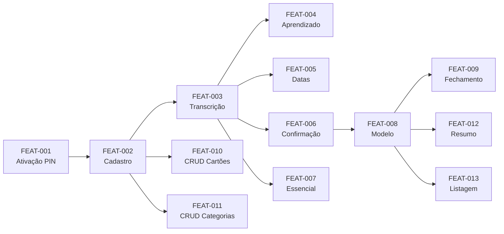

# PRD — Finance Bot Telegram

> **Resumo executivo:** Bot Telegram para registro de despesas pessoais via áudio com transcrição automática (Groq Whisper) e categorização inteligente por IA (Gemini Flash). Objetivo: reduzir tempo de registro de 2 minutos para 10 segundos, eliminando fricção e abandono de controle financeiro pessoal.

---

## 1. Visão Geral

Um agente via Telegram que recebe áudios de despesas, transcreve automaticamente, extrai dados (valor, categoria, data) e categoriza com IA. O sistema aprende padrões do usuário ao longo do tempo, reduzindo confirmações manuais. Foco em zero fricção: enviar áudio e confirmar com um toque.

---

## 2. Classificação do Projeto

| Aspecto | Valor |
|---------|-------|
| **Perfil** | PESSOAL |
| **Usuários** | Single-user (apenas o desenvolvedor) |
| **Exposição** | Local (Docker Compose + ngrok) |
| **PII** | Dados financeiros básicos |

---

## 3. Objetivos e Não-Objetivos

### Objetivos (MVP)

- [ ] Registrar despesas via áudio em &lt;10 segundos
- [ ] Transcrever áudio com precisão &gt;95%
- [ ] Categorizar automaticamente com precisão &gt;85%
- [ ] Aprender padrões do usuário para reduzir confirmações
- [ ] Calcular corretamente vencimentos de cartão de crédito
- [ ] Gerar resumo mensal por categoria

### Não-Objetivos (Fora do Escopo MVP)

- ❌ Integração bancária (Open Finance)
- ❌ App mobile nativo (só Telegram)
- ❌ Multi-idioma (apenas PT-BR)
- ❌ Gráficos avançados (só texto no MVP)
- ❌ Compartilhamento multi-user
- ❌ OCR de notas fiscais
- ❌ Investimentos e patrimônio

---

## 4. Personas/Papéis

| Persona | Descrição | Permissões |
|---------|-----------|------------|
| **Usuário** | Único usuário do sistema (desenvolvedor) | Todas as operações |

---

## 5. User Stories

### FEAT-001: Ativação do Bot com PIN

**Como** usuário novo, **quero** ativar o bot com um PIN, **para** garantir que apenas eu acesse meus dados financeiros.

#### Critérios de aceite (Gherkin)

```gherkin
# TEST-001: Happy path - Criação de PIN válido
Given um usuário novo envia /start
When ele digita um PIN de 6 dígitos "123456"
And confirma o PIN "123456"
Then o sistema cria o usuário com PIN hasheado (bcrypt, cost=12)
And responde "✅ PIN criado! Vamos configurar seus cartões."
And inicia o wizard de onboarding

# TEST-002: Unhappy path - PIN formato inválido
Given um usuário novo está criando PIN
When ele digita "abc123"
Then o sistema responde:
  """
  ❌ PIN inválido. Digite apenas 4-6 números.
  code: AUTH.INVALID_PIN
  """
And NÃO cria o usuário

# TEST-003: Unhappy path - Bloqueio após tentativas
Given um usuário com PIN "123456" e 2 tentativas falhas
When ele digita PIN errado "000000"
Then o sistema bloqueia a conta por 15 minutos
And responde:
  """
  🔒 Conta bloqueada por muitas tentativas.
  Tente novamente em 15 minutos.
  code: AUTH.ACCOUNT_LOCKED
  """
```

#### Regras de negócio
- **RULE-007:** Bloqueio de conta após 3 tentativas de PIN (15 min)
- **RULE-008:** Sessão expira após 24h de inatividade

#### Testes associados
- TEST-001: Criação de PIN válido (P0)
- TEST-002: PIN formato inválido (P0)
- TEST-003: Bloqueio após tentativas (P0)

---

### FEAT-002: Cadastro Inicial (Wizard, Cartões, Categorias)

**Como** usuário, **quero** cadastrar meus cartões e ter categorias padrão, **para** começar a usar o bot.

#### Critérios de aceite (Gherkin)

```gherkin
# TEST-010: Happy path - Cadastro de cartão
Given um usuário autenticado
When ele executa /add_cartao
And informa nome "Nubank"
And informa últimos dígitos "1234"
And informa dia de fechamento "10"
And informa dia de vencimento "18"
Then o sistema cria o cartão no banco
And responde:
  """
  ✅ Cartão cadastrado!
  
  💳 Nubank (*1234)
  📅 Fechamento: dia 10
  📅 Vencimento: dia 18
  """

# TEST-011: Unhappy path - Dígitos inválidos
Given um usuário autenticado cadastrando cartão
When ele informa últimos dígitos "12AB"
Then o sistema responde:
  """
  ❌ Digite apenas 4 dígitos numéricos (ex: 1234).
  code: CARD.INVALID_DIGITS
  """
```

#### Regras de negócio
- **RULE-001:** Validação de cartão (closing_day 1-31, due_day 1-31, 4 dígitos numéricos)

#### Testes associados
- TEST-010: Cadastro de cartão válido (P0)
- TEST-011: Cartão com dígitos inválidos (P1)

---

### FEAT-003: Transcrição e Extração de Dados via Áudio

**Como** usuário, **quero** enviar um áudio de despesa e ter os dados extraídos automaticamente, **para** não precisar digitar.

#### Critérios de aceite (Gherkin)

```gherkin
# TEST-020: Happy path - Transcrição simples
Given um usuário autenticado
And a API Groq está disponível
When ele envia áudio dizendo "Gastei trinta reais no Uber hoje"
Then o sistema transcreve o áudio via Groq Whisper
And extrai entidades via Gemini Flash:
  | campo | valor |
  | description | Uber |
  | amount | 30.00 |
  | date | 2026-02-01 |
  | category_suggestion | Transporte |
And mostra resumo com botões [Confirmar] [Editar] [Cancelar]

# TEST-021: Unhappy path - Áudio não relacionado
Given um usuário autenticado
When ele envia áudio dizendo "Oi, como você está?"
Then o sistema transcreve o áudio
And NÃO identifica despesa
And responde:
  """
  🤔 Não identifiquei nenhuma despesa.
  Tente algo como "Gastei R$50 no supermercado".
  code: EXPENSE.NOT_DETECTED
  """

# TEST-022: Happy path - Múltiplas despesas
Given um usuário autenticado
When ele envia áudio dizendo "Comprei 30 reais em carne e 20 reais em cerveja"
Then o sistema extrai 2 despesas:
  | description | amount | is_essential |
  | Carne | 30.00 | true |
  | Cerveja | 20.00 | false |
```

#### Regras de negócio
- **RULE-009:** Áudio deletado após 7 dias da transcrição
- **RULE-010:** Fallback de transcrição só em erro/timeout do Groq

#### Testes associados
- TEST-020: Transcrição simples (P0)
- TEST-021: Áudio não relacionado (P1)
- TEST-022: Múltiplas despesas (P1)

---

### FEAT-004: Categorização Inteligente com Aprendizado

**Como** usuário, **quero** que o bot aprenda meus padrões de gastos, **para** categorizar automaticamente no futuro.

#### Critérios de aceite (Gherkin)

```gherkin
# TEST-030: Sugestão baseada em histórico
Given um usuário que confirmou "Uber" como Transporte 3 vezes
When ele envia áudio "Gastei 40 reais no Uber"
Then o sistema busca no histórico de categorização
And encontra "uber" (normalizado) com count=3
And sugere categoria "Transporte" com confiança 0.95
And NÃO chama o LLM para categorização
```

#### Regras de negócio
- **RULE-003:** Aprendizado: só sugerir categoria se confirmada >= 3 vezes
- **RULE-005:** Normalização de descrição: lower(unaccent(trim()))

#### Testes associados
- TEST-030: Sugestão baseada em histórico (P1)

---

### FEAT-005: Interpretação de Datas Relativas

**Como** usuário, **quero** falar "gastei ontem" ou "no sábado passado", **para** que o bot entenda a data correta.

#### Critérios de aceite (Gherkin)

```gherkin
# TEST-023: Interpretação de "ontem"
Given a data atual é 2026-02-01 (sábado)
When o sistema interpreta "gastei 50 reais ontem no mercado"
Then a data extraída é 2026-01-31
And a confirmação mostra "31/01/2026 (ontem)"

# TEST-024: Rejeição de data futura
Given a data atual é 2026-02-01
When o sistema interpreta "vou gastar amanhã"
Then retorna erro:
  """
  ❌ Data inválida. Despesas devem ser passadas ou de hoje.
  code: EXPENSE.FUTURE_DATE
  """
```

#### Testes associados
- TEST-023: Interpretação de "ontem" (P0)
- TEST-024: Data futura rejeitada (P1)

---

### FEAT-006: Fluxo de Confirmação Interativa

**Como** usuário, **quero** confirmar ou editar dados extraídos antes de salvar, **para** garantir precisão.

#### Critérios de aceite (Gherkin)

```gherkin
# Happy path - Confiança alta (>= 0.9)
Given uma despesa extraída com confiança 0.92
When o sistema mostra o resumo
Then exibe todos os campos com ✅
And mostra botões [✅ Confirmar] [✏️ Editar] [❌ Cancelar]

# Happy path - Confiança baixa (< 0.9)
Given uma despesa extraída com confiança 0.75 no campo categoria
When o sistema mostra o resumo
Then destaca categoria com ❓
And mostra botões específicos [Escolher Categoria]
```

#### Regras de negócio
- **RULE-006:** Confiança >= 0.9 permite confirmação direta

---

### FEAT-007: Categorização Essencial vs Não Essencial

**Como** usuário, **quero** que o bot diferencie gastos essenciais de não essenciais, **para** análise mais detalhada.

#### Critérios de aceite
- Alimentação básica (arroz, feijão) = Essencial
- Alimentação supérflua (cerveja, restaurante) = Não Essencial
- Transporte para trabalho = Essencial
- Transporte para lazer = Não Essencial

---

### FEAT-008: Modelo Despesa vs Lançamento

**Como** sistema, **preciso** diferenciar despesas (registro único) de lançamentos (parcelas), **para** calcular faturas corretamente.

#### Critérios de aceite (Gherkin)

```gherkin
# TEST-042: Despesa parcelada em 3x
Given um usuário com cartão Nubank (fechamento 10, vencimento 18)
When ele confirma despesa de R$300,00 em 3x no crédito em 05/02/2026
Then o sistema cria 1 registro em `expenses` com total_amount=300.00
And cria 3 registros em `entries`:
  | installment_number | amount | due_date | competence_month | status |
  | 1 | 100.00 | 2026-03-18 | 2026-03 | pending |
  | 2 | 100.00 | 2026-04-18 | 2026-04 | pending |
  | 3 | 100.00 | 2026-05-18 | 2026-05 | pending |
```

#### Regras de negócio
- **RULE-002:** State Machine de lançamento (pending → paid/cancelled)

#### Testes associados
- TEST-042: Parcelas distribuídas (P0)

---

### FEAT-009: Lógica de Fechamento de Cartão de Crédito

**Como** usuário, **quero** que despesas parceladas no cartão sejam lançadas corretamente, **para** saber quanto pagarei em cada fatura.

#### Critérios de aceite (Gherkin)

```gherkin
# TEST-040: Compra antes do fechamento
Given um cartão com fechamento dia 22 e vencimento dia 5
When uma despesa é criada em 21/01/2026 (antes do fechamento)
Then o vencimento da 1ª parcela é 05/02/2026
And a competência é "2026-02"

# TEST-041: Compra após fechamento
Given um cartão com fechamento dia 22 e vencimento dia 5
When uma despesa é criada em 23/01/2026 (após fechamento)
Then o vencimento da 1ª parcela é 05/03/2026
And a competência é "2026-03"
```

#### Regras de negócio
- **RULE-004:** Cálculo de vencimento baseado em fechamento

#### Testes associados
- TEST-040: Vencimento antes fechamento (P0)
- TEST-041: Vencimento após fechamento (P0)

---

### FEAT-010: CRUD de Cartões

**Como** usuário, **quero** gerenciar meus cartões (adicionar, editar, excluir), **para** manter dados atualizados.

#### Comandos
- `/add_cartao` — Adicionar novo cartão
- `/list_cartoes` — Listar cartões cadastrados
- `/edit_cartao <id>` — Editar cartão
- `/delete_cartao <id>` — Excluir cartão (soft delete)

---

### FEAT-011: CRUD de Categorias

**Como** usuário, **quero** personalizar categorias, **para** adequar às minhas necessidades.

#### Comandos
- `/add_categoria <nome>` — Adicionar categoria
- `/list_categorias` — Listar categorias
- `/delete_categoria <id>` — Excluir categoria

---

### FEAT-012: Resumo Mensal

**Como** usuário, **quero** ver um resumo de gastos do mês, **para** entender para onde vai meu dinheiro.

#### Critérios de aceite (Gherkin)

```gherkin
# TEST-050: Geração de resumo mensal
Given um usuário com 3 despesas em Fevereiro/2026:
  | description | amount | category | is_essential |
  | Uber | 30.00 | Transporte | false |
  | Mercado | 200.00 | Alimentação | true |
  | Cinema | 50.00 | Lazer | false |
When ele executa /resumo
Then o sistema calcula totais por categoria
And mostra percentuais
And mostra comparativo com mês anterior
```

#### Testes associados
- TEST-050: Geração de resumo mensal (P1)

---

### FEAT-013: Listagem de Despesas

**Como** usuário, **quero** ver uma lista das últimas despesas, **para** conferir registros.

#### Comandos
- `/despesas` — Listar despesas do mês atual
- `/despesas <mes>` — Listar despesas de um mês específico

---

### FEAT-014: Logs de Processamento

**Como** desenvolvedor, **quero** rastrear erros de transcrição, **para** melhorar o modelo.

---

### FEAT-015: Métricas de Uso de API

**Como** desenvolvedor, **quero** monitorar custo de APIs, **para** evitar surpresas.

---

## 6. Grafo de Dependências



---

## 7. Regras de Negócio Consolidadas

| ID | Regra | Features | Erro se violada |
|----|-------|----------|-----------------|
| RULE-001 | Validação de cartão (closing_day 1-31, due_day 1-31, 4 dígitos) | FEAT-002, FEAT-010 | CARD.VALIDATION_ERROR |
| RULE-002 | State Machine: lançamento (pending → paid/cancelled) | FEAT-008 | ENTRY.INVALID_TRANSITION |
| RULE-003 | Aprendizado: só sugerir se confirmada >= 3 vezes | FEAT-004 | - |
| RULE-004 | Cálculo de vencimento baseado em fechamento | FEAT-009 | - |
| RULE-005 | Normalização: lower(unaccent(trim())) | FEAT-004 | - |
| RULE-006 | Confiança >= 0.9 permite confirmação direta | FEAT-006 | - |
| RULE-007 | Bloqueio após 3 tentativas de PIN (15 min) | FEAT-001 | AUTH.ACCOUNT_LOCKED |
| RULE-008 | Sessão expira após 24h de inatividade | FEAT-001 | AUTH.SESSION_EXPIRED |
| RULE-009 | Áudio deletado após 7 dias | FEAT-003 | - |
| RULE-010 | Fallback transcrição só em erro/timeout | FEAT-003 | - |

---

## 8. Mapa de Erros

| Code | Severity | Quando ocorre | HTTP | i18nKey |
|------|----------|---------------|------|---------|
| AUTH.INVALID_PIN | WARNING | PIN com formato inválido | - | errors.auth.invalid_pin |
| AUTH.PIN_MISMATCH | WARNING | Confirmação de PIN diferente | - | errors.auth.pin_mismatch |
| AUTH.ACCOUNT_LOCKED | ERROR | 3 tentativas erradas | - | errors.auth.account_locked |
| AUTH.SESSION_EXPIRED | WARNING | Sessão expirada | - | errors.auth.session_expired |
| CARD.NAME_REQUIRED | WARNING | Nome vazio | - | errors.card.name_required |
| CARD.INVALID_DIGITS | WARNING | Dígitos não numéricos | - | errors.card.invalid_digits |
| CARD.INVALID_CLOSING_DAY | WARNING | Dia fechamento fora 1-31 | - | errors.card.invalid_closing |
| CARD.NOT_FOUND | WARNING | Cartão não existe | - | errors.card.not_found |
| CARD.DUPLICATE | WARNING | Nome duplicado | - | errors.card.duplicate |
| AUDIO.FORMAT_NOT_SUPPORTED | WARNING | Formato inválido | - | errors.audio.format |
| AUDIO.TOO_LONG | WARNING | Áudio > 60s | - | errors.audio.too_long |
| AUDIO.TRANSCRIPTION_FAILED | ERROR | Falha Groq + fallback | - | errors.audio.transcription |
| EXPENSE.NOT_DETECTED | INFO | Sem despesa no áudio | - | errors.expense.not_detected |
| EXPENSE.FUTURE_DATE | WARNING | Data futura | - | errors.expense.future_date |
| REPORT.INVALID_MONTH | WARNING | Mês inválido | - | errors.report.invalid_month |
| REPORT.NO_DATA | INFO | Sem dados no período | - | errors.report.no_data |

---

## 9. Métricas de Sucesso

| Métrica | Baseline | Target | Como medir |
|---------|----------|--------|------------|
| Despesas registradas/mês | 0 | 50 | COUNT(expenses) |
| Precisão de transcrição | - | >95% | Edições manuais / total |
| Precisão de categorização | - | >85% | Edições de categoria / total |
| Taxa de confirmação manual | - | <20% | Confiança < 0.9 / total |
| Taxa de edição manual | - | <10% | Despesas editadas / total |
| Custo mensal de APIs | - | <R$50 | SUM(api_metrics.cost_usd) |
