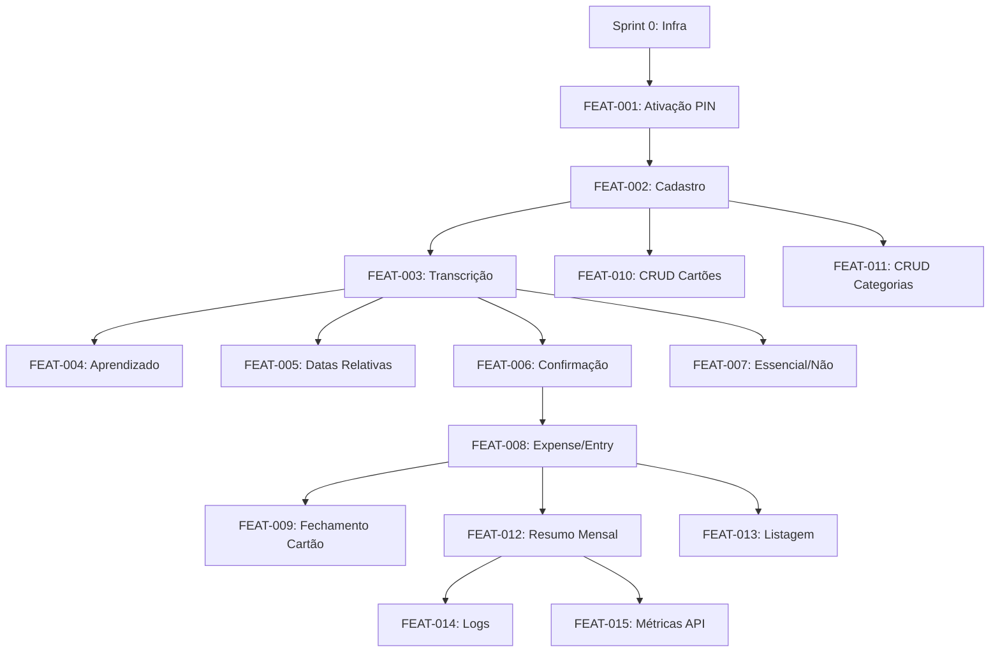

# Progress Tracker — Finance Bot Telegram

> **Fonte de verdade para acompanhamento do projeto.** Atualizar ANTES de iniciar e DEPOIS de concluir cada task.

---

## Legenda

| Símbolo | Status | Descrição |
|---------|--------|-----------|
| ⏳ | PENDING | Não iniciado |
| 🔄 | IN_PROGRESS | Em desenvolvimento |
| ✅ | DONE | Concluído e validado (DOD completo) |
| 🚫 | BLOCKED | Bloqueado por dependência |
| ⏸️ | PAUSED | Pausado (motivo documentado) |

---

## Visão Geral

```
Sprint 0: Infra ────────────────────────────────────┐
                                                    ▼
Sprint 1: Auth (FEAT-001) ──────────────────────────┤
                                                    ▼
Sprint 2: Onboarding (FEAT-002, 010, 011) ──────────┤
                                                    ▼
Sprint 3: Core Audio (FEAT-003, 005) ───────────────┤
                                                    ▼
Sprint 4: Categorização (FEAT-004, 006, 007) ───────┤
                                                    ▼
Sprint 5: Financeiro (FEAT-008, 009) ───────────────┤
                                                    ▼
Sprint 6: Relatórios (FEAT-012, 013) ───────────────┤
                                                    ▼
Sprint 7: Observabilidade (FEAT-014, 015) ──────────┘
```

---

## Grafo de Dependências



---

## Sprint 0: Infraestrutura ⏳

**Objetivo:** Setup inicial do projeto, ambiente de desenvolvimento funcional.

**Dependências:** Nenhuma (ponto de entrada)

### Tarefas

| ID | Task | Status | Branch | Dependência | DOD |
|----|------|--------|--------|-------------|-----|
| INFRA-001 | Criar estrutura de diretórios | ⏳ | `chore/estrutura-inicial` | - | [ ] |
| INFRA-002 | Setup Docker Compose (bot + postgres) | ⏳ | `chore/docker-compose-setup` | INFRA-001 | [ ] |
| INFRA-003 | Configurar SQLModel + Alembic | ⏳ | `chore/sqlmodel-alembic` | INFRA-002 | [ ] |
| INFRA-004 | Setup pytest + fixtures | ⏳ | `chore/pytest-setup` | INFRA-003 | [ ] |
| INFRA-005 | Configurar ruff + mypy | ⏳ | `chore/linting-setup` | INFRA-001 | [ ] |
| INFRA-006 | Setup python-telegram-bot básico | ⏳ | `chore/telegram-bot-setup` | INFRA-002 | [ ] |
| INFRA-007 | Criar .env.example | ⏳ | `chore/env-example` | INFRA-006 | [ ] |

### Critérios de Saída Sprint 0

- [ ] `docker compose up -d` sobe bot + postgres sem erros
- [ ] `pytest tests/` executa (mesmo sem testes reais)
- [ ] `ruff check . && mypy .` passa
- [ ] Bot responde a /start com mensagem placeholder

---

## Sprint 1: Autenticação (FEAT-001) ⏳

**Objetivo:** Usuário pode criar PIN e autenticar-se.

**Dependências:** Sprint 0 completo

**Documentação:**
- PRD: FEAT-001 (linhas 57-103)
- TECH_SPECS: Handler /start (linhas 368-402)
- SECURITY: Seção 3 - AuthN (linhas 43-84)

### Tarefas

| ID | Task | Status | Branch | Dependência | DOD |
|----|------|--------|--------|-------------|-----|
| AUTH-001 | Criar modelo User (SQLModel) | ⏳ | `feat/FEAT-001-model-user` | INFRA-003 | [ ] |
| AUTH-002 | Migration inicial users | ⏳ | `feat/FEAT-001-migration-users` | AUTH-001 | [ ] |
| AUTH-003 | Implementar hash bcrypt (cost=12) | ⏳ | `feat/FEAT-001-bcrypt-hash` | AUTH-001 | [ ] |
| AUTH-004 | Handler /start (novo usuário) | ⏳ | `feat/FEAT-001-start-handler` | AUTH-002, INFRA-006 | [ ] |
| AUTH-005 | ConversationHandler criação PIN | ⏳ | `feat/FEAT-001-pin-creation` | AUTH-004 | [ ] |
| AUTH-006 | Validação PIN (4-6 dígitos) | ⏳ | `feat/FEAT-001-pin-validation` | AUTH-005 | [ ] |
| AUTH-007 | Handler login (usuário existente) | ⏳ | `feat/FEAT-001-login-handler` | AUTH-003 | [ ] |
| AUTH-008 | Lógica de bloqueio (3 tentativas) | ⏳ | `feat/FEAT-001-account-lock` | AUTH-007 | [ ] |
| AUTH-009 | Sessão com expiração 24h | ⏳ | `feat/FEAT-001-session-expiry` | AUTH-007 | [ ] |

### Testes (PRD)

| TEST ID | Cenário | Prioridade | Status | Implementado em |
|---------|---------|------------|--------|-----------------|
| TEST-001 | Criação de PIN válido | P0 | ⏳ | AUTH-005 |
| TEST-002 | PIN formato inválido | P0 | ⏳ | AUTH-006 |
| TEST-003 | Bloqueio após tentativas | P0 | ⏳ | AUTH-008 |

### Regras de Negócio

| RULE ID | Regra | Implementado em | Validado |
|---------|-------|-----------------|----------|
| RULE-007 | Bloqueio após 3 tentativas (15 min) | AUTH-008 | [ ] |
| RULE-008 | Sessão expira após 24h | AUTH-009 | [ ] |

### Critérios de Saída Sprint 1

- [ ] Novo usuário consegue criar PIN
- [ ] Usuário existente faz login com PIN
- [ ] Conta bloqueia após 3 erros
- [ ] Todos os TEST-00X passam
- [ ] Código de erro AUTH.* funcionam

---

## Sprint 2: Onboarding (FEAT-002, 010, 011) ⏳

**Objetivo:** Cadastro de cartões e categorias.

**Dependências:** Sprint 1 completo

**Documentação:**
- PRD: FEAT-002 (linhas 107-158), FEAT-010, FEAT-011
- TECH_SPECS: Handler /add_cartao (linhas 487-509)

### Tarefas

| ID | Task | Status | Branch | Dependência | DOD |
|----|------|--------|--------|-------------|-----|
| ONBOARD-001 | Criar modelo Card (SQLModel) | ⏳ | `feat/FEAT-002-model-card` | AUTH-001 | [ ] |
| ONBOARD-002 | Criar modelo Category (SQLModel) | ⏳ | `feat/FEAT-002-model-category` | AUTH-001 | [ ] |
| ONBOARD-003 | Migration cards + categories | ⏳ | `feat/FEAT-002-migration` | ONBOARD-001, ONBOARD-002 | [ ] |
| ONBOARD-004 | Seed categorias padrão | ⏳ | `feat/FEAT-002-seed-categories` | ONBOARD-003 | [ ] |
| ONBOARD-005 | Handler /add_cartao | ⏳ | `feat/FEAT-010-add-cartao` | ONBOARD-003 | [ ] |
| ONBOARD-006 | Validação cartão (RULE-001) | ⏳ | `feat/FEAT-010-card-validation` | ONBOARD-005 | [ ] |
| ONBOARD-007 | Handler /list_cartoes | ⏳ | `feat/FEAT-010-list-cartoes` | ONBOARD-005 | [ ] |
| ONBOARD-008 | Handler /delete_cartao (soft) | ⏳ | `feat/FEAT-010-delete-cartao` | ONBOARD-007 | [ ] |
| ONBOARD-009 | Handler /add_categoria | ⏳ | `feat/FEAT-011-add-categoria` | ONBOARD-003 | [ ] |
| ONBOARD-010 | Handler /list_categorias | ⏳ | `feat/FEAT-011-list-categorias` | ONBOARD-009 | [ ] |
| ONBOARD-011 | Wizard de onboarding (pós-PIN) | ⏳ | `feat/FEAT-002-wizard` | ONBOARD-005, AUTH-005 | [ ] |

### Testes (PRD)

| TEST ID | Cenário | Prioridade | Status | Implementado em |
|---------|---------|------------|--------|-----------------|
| TEST-010 | Cadastro de cartão válido | P0 | ⏳ | ONBOARD-005 |
| TEST-011 | Cartão com dígitos inválidos | P1 | ⏳ | ONBOARD-006 |
| TEST-012 | Dia de fechamento inválido | P1 | ⏳ | ONBOARD-006 |

### Regras de Negócio

| RULE ID | Regra | Implementado em | Validado |
|---------|-------|-----------------|----------|
| RULE-001 | Validação cartão (closing 1-31, due 1-31, 4 dígitos) | ONBOARD-006 | [ ] |

### Critérios de Saída Sprint 2

- [ ] Usuário cadastra cartão com sucesso
- [ ] Validações de cartão funcionam
- [ ] Categorias padrão criadas automaticamente
- [ ] CRUD de categorias funciona
- [ ] Wizard de onboarding completo

---

## Sprint 3: Core Audio (FEAT-003, 005) ⏳

**Objetivo:** Transcrição de áudio e interpretação de datas.

**Dependências:** Sprint 2 completo

**Documentação:**
- PRD: FEAT-003 (linhas 162-223), FEAT-005 (linhas 262-295)
- TECH_SPECS: Handler Áudio (linhas 405-458), Integrações (linhas 538-608)
- ADR: ADR-005 (Groq Whisper)

### Tarefas

| ID | Task | Status | Branch | Dependência | DOD |
|----|------|--------|--------|-------------|-----|
| AUDIO-001 | Service Groq Whisper (transcrição) | ⏳ | `feat/FEAT-003-groq-service` | INFRA-007 | [ ] |
| AUDIO-002 | Handler mensagem de áudio | ⏳ | `feat/FEAT-003-audio-handler` | AUDIO-001 | [ ] |
| AUDIO-003 | Validação duração áudio (max 60s) | ⏳ | `feat/FEAT-003-audio-validation` | AUDIO-002 | [ ] |
| AUDIO-004 | Service Gemini (extração entidades) | ⏳ | `feat/FEAT-003-gemini-service` | INFRA-007 | [ ] |
| AUDIO-005 | Prompt engineering extração | ⏳ | `feat/FEAT-003-extraction-prompt` | AUDIO-004 | [ ] |
| AUDIO-006 | Parser de resposta Gemini | ⏳ | `feat/FEAT-003-gemini-parser` | AUDIO-005 | [ ] |
| AUDIO-007 | Interpretação datas relativas | ⏳ | `feat/FEAT-005-date-parsing` | AUDIO-006 | [ ] |
| AUDIO-008 | Validação data não futura | ⏳ | `feat/FEAT-005-date-validation` | AUDIO-007 | [ ] |
| AUDIO-009 | Detecção múltiplas despesas | ⏳ | `feat/FEAT-003-multi-expense` | AUDIO-006 | [ ] |
| AUDIO-010 | Fluxo completo áudio→extração | ⏳ | `feat/FEAT-003-audio-flow` | AUDIO-009 | [ ] |

### Testes (PRD)

| TEST ID | Cenário | Prioridade | Status | Implementado em |
|---------|---------|------------|--------|-----------------|
| TEST-020 | Transcrição simples | P0 | ⏳ | AUDIO-010 |
| TEST-021 | Áudio não relacionado | P1 | ⏳ | AUDIO-006 |
| TEST-022 | Múltiplas despesas | P1 | ⏳ | AUDIO-009 |
| TEST-023 | Áudio muito longo | P1 | ⏳ | AUDIO-003 |
| TEST-024 | Interpretação "ontem" | P0 | ⏳ | AUDIO-007 |
| TEST-025 | "sábado passado" | P1 | ⏳ | AUDIO-007 |
| TEST-026 | Data futura rejeitada | P1 | ⏳ | AUDIO-008 |

### Regras de Negócio

| RULE ID | Regra | Implementado em | Validado |
|---------|-------|-----------------|----------|
| RULE-009 | Áudio deletado após 7 dias | AUDIO-002 | [ ] |
| RULE-010 | Fallback transcrição só em erro/timeout | AUDIO-001 | [ ] |

### Critérios de Saída Sprint 3

- [ ] Áudio transcrito com sucesso
- [ ] Entidades extraídas (valor, descrição, data)
- [ ] Datas relativas interpretadas corretamente
- [ ] Erros de áudio tratados (muito longo, sem despesa)

---

## Sprint 4: Categorização (FEAT-004, 006, 007) ⏳

**Objetivo:** Categorização inteligente e fluxo de confirmação.

**Dependências:** Sprint 3 completo

**Documentação:**
- PRD: FEAT-004 (linhas 227-258), FEAT-006 (linhas 299-338), FEAT-007 (linhas 342-355)
- ADR: ADR-006 (Categorização híbrida)

### Tarefas

| ID | Task | Status | Branch | Dependência | DOD |
|----|------|--------|--------|-------------|-----|
| CAT-001 | Criar modelo CategoryPattern | ⏳ | `feat/FEAT-004-model-pattern` | ONBOARD-002 | [ ] |
| CAT-002 | Migration category_patterns | ⏳ | `feat/FEAT-004-migration` | CAT-001 | [ ] |
| CAT-003 | Service normalização descrição | ⏳ | `feat/FEAT-004-normalize` | CAT-001 | [ ] |
| CAT-004 | Busca no histórico (>= 3 confirmações) | ⏳ | `feat/FEAT-004-history-lookup` | CAT-003 | [ ] |
| CAT-005 | Fallback para Gemini | ⏳ | `feat/FEAT-004-llm-fallback` | CAT-004, AUDIO-004 | [ ] |
| CAT-006 | Incrementar confirmation_count | ⏳ | `feat/FEAT-004-increment-count` | CAT-004 | [ ] |
| CAT-007 | Classificar essencial/não essencial | ⏳ | `feat/FEAT-007-essential` | AUDIO-006 | [ ] |
| CAT-008 | Mostrar resumo com botões inline | ⏳ | `feat/FEAT-006-show-summary` | AUDIO-010 | [ ] |
| CAT-009 | Handler callback confirmação | ⏳ | `feat/FEAT-006-callback-confirm` | CAT-008 | [ ] |
| CAT-010 | Handler callback edição | ⏳ | `feat/FEAT-006-callback-edit` | CAT-008 | [ ] |
| CAT-011 | Handler callback cancelamento | ⏳ | `feat/FEAT-006-callback-cancel` | CAT-008 | [ ] |
| CAT-012 | Timeout de confirmação (10 min) | ⏳ | `feat/FEAT-006-timeout` | CAT-009 | [ ] |
| CAT-013 | Highlight campos baixa confiança | ⏳ | `feat/FEAT-006-low-confidence` | CAT-008 | [ ] |

### Testes (PRD)

| TEST ID | Cenário | Prioridade | Status | Implementado em |
|---------|---------|------------|--------|-----------------|
| TEST-030 | Sugestão baseada em histórico | P1 | ⏳ | CAT-004 |
| TEST-031 | Fallback para LLM | P1 | ⏳ | CAT-005 |
| TEST-032 | Confirmação confiança alta | P0 | ⏳ | CAT-009 |
| TEST-033 | Confirmação confiança baixa | P1 | ⏳ | CAT-013 |
| TEST-034 | Timeout de confirmação | P2 | ⏳ | CAT-012 |

### Regras de Negócio

| RULE ID | Regra | Implementado em | Validado |
|---------|-------|-----------------|----------|
| RULE-003 | Aprendizado: só sugerir se >= 3 vezes | CAT-004 | [ ] |
| RULE-005 | Normalização: lower(unaccent(trim())) | CAT-003 | [ ] |
| RULE-006 | Confiança >= 0.9 confirmação direta | CAT-008 | [ ] |

### Critérios de Saída Sprint 4

- [ ] Categorização por histórico funciona
- [ ] Fallback para LLM funciona
- [ ] Fluxo de confirmação completo
- [ ] Aprendizado incrementa contador

---

## Sprint 5: Financeiro (FEAT-008, 009) ⏳

**Objetivo:** Modelo de despesa/lançamento e cálculo de faturas.

**Dependências:** Sprint 4 completo

**Documentação:**
- PRD: FEAT-008 (linhas 358-391), FEAT-009 (linhas 394-428)
- TECH_SPECS: Entidades Expense/Entry (linhas 136-217), State Machine (linhas 345-361)
- ADR: ADR-004

### Tarefas

| ID | Task | Status | Branch | Dependência | DOD |
|----|------|--------|--------|-------------|-----|
| FIN-001 | Criar modelo Expense (SQLModel) | ⏳ | `feat/FEAT-008-model-expense` | ONBOARD-001, ONBOARD-002 | [ ] |
| FIN-002 | Criar modelo Entry (SQLModel) | ⏳ | `feat/FEAT-008-model-entry` | FIN-001 | [ ] |
| FIN-003 | Migration expenses + entries | ⏳ | `feat/FEAT-008-migration` | FIN-002 | [ ] |
| FIN-004 | Service criar despesa à vista | ⏳ | `feat/FEAT-008-expense-avista` | FIN-003 | [ ] |
| FIN-005 | Service criar despesa parcelada | ⏳ | `feat/FEAT-008-expense-parcelada` | FIN-004 | [ ] |
| FIN-006 | Cálculo vencimento antes fechamento | ⏳ | `feat/FEAT-009-due-before-close` | FIN-005 | [ ] |
| FIN-007 | Cálculo vencimento após fechamento | ⏳ | `feat/FEAT-009-due-after-close` | FIN-006 | [ ] |
| FIN-008 | Gerar entries para parcelas | ⏳ | `feat/FEAT-008-generate-entries` | FIN-007 | [ ] |
| FIN-009 | State machine Entry (pending→paid/cancelled) | ⏳ | `feat/FEAT-008-entry-state` | FIN-002 | [ ] |
| FIN-010 | Integrar confirmação→criar despesa | ⏳ | `feat/FEAT-008-confirm-create` | CAT-009, FIN-008 | [ ] |

### Testes (PRD)

| TEST ID | Cenário | Prioridade | Status | Implementado em |
|---------|---------|------------|--------|-----------------|
| TEST-040 | Despesa à vista (débito) | P0 | ⏳ | FIN-004 |
| TEST-041 | Despesa parcelada em 3x | P0 | ⏳ | FIN-005 |
| TEST-042 | Compra antes do fechamento | P0 | ⏳ | FIN-006 |
| TEST-043 | Compra após fechamento | P0 | ⏳ | FIN-007 |
| TEST-044 | Fechamento fim do mês | P1 | ⏳ | FIN-007 |

### Regras de Negócio

| RULE ID | Regra | Implementado em | Validado |
|---------|-------|-----------------|----------|
| RULE-002 | State Machine: pending → paid/cancelled | FIN-009 | [ ] |
| RULE-004 | Cálculo vencimento baseado em fechamento | FIN-006, FIN-007 | [ ] |

### Critérios de Saída Sprint 5

- [ ] Despesa à vista cria 1 entry
- [ ] Despesa parcelada cria N entries
- [ ] Vencimentos calculados corretamente
- [ ] State machine funciona

---

## Sprint 6: Relatórios (FEAT-012, 013) ⏳

**Objetivo:** Resumo mensal e listagem de despesas.

**Dependências:** Sprint 5 completo

**Documentação:**
- PRD: FEAT-012 (linhas 458-502), FEAT-013 (linhas 506-514)
- TECH_SPECS: Handler /resumo (linhas 512-534)

### Tarefas

| ID | Task | Status | Branch | Dependência | DOD |
|----|------|--------|--------|-------------|-----|
| REP-001 | Handler /despesas (mês atual) | ⏳ | `feat/FEAT-013-despesas` | FIN-003 | [ ] |
| REP-002 | Handler /despesas MM/YYYY | ⏳ | `feat/FEAT-013-despesas-mes` | REP-001 | [ ] |
| REP-003 | Service cálculo resumo mensal | ⏳ | `feat/FEAT-012-resumo-service` | FIN-003 | [ ] |
| REP-004 | Cálculo essenciais vs não essenciais | ⏳ | `feat/FEAT-012-essenciais` | REP-003 | [ ] |
| REP-005 | Agrupamento por categoria | ⏳ | `feat/FEAT-012-por-categoria` | REP-004 | [ ] |
| REP-006 | Comparativo mês anterior | ⏳ | `feat/FEAT-012-comparativo` | REP-005 | [ ] |
| REP-007 | Handler /resumo | ⏳ | `feat/FEAT-012-resumo-handler` | REP-006 | [ ] |
| REP-008 | Handler /resumo MM/YYYY | ⏳ | `feat/FEAT-012-resumo-mes` | REP-007 | [ ] |

### Testes (PRD)

| TEST ID | Cenário | Prioridade | Status | Implementado em |
|---------|---------|------------|--------|-----------------|
| TEST-050 | Geração resumo mensal | P1 | ⏳ | REP-007 |
| TEST-051 | Resumo sem dados | P2 | ⏳ | REP-007 |

### Critérios de Saída Sprint 6

- [ ] /despesas lista despesas do mês
- [ ] /resumo mostra totais por categoria
- [ ] Percentuais essencial/não essencial corretos
- [ ] Comparativo com mês anterior

---

## Sprint 7: Observabilidade (FEAT-014, 015) ⏳

**Objetivo:** Logs estruturados e métricas de API.

**Dependências:** Sprint 6 completo

**Documentação:**
- PRD: FEAT-014, FEAT-015
- TECH_SPECS: ApiMetric (linhas 245-262)
- SECURITY: Seção 7 - Logging Seguro (linhas 143-176)

### Tarefas

| ID | Task | Status | Branch | Dependência | DOD |
|----|------|--------|--------|-------------|-----|
| OBS-001 | Criar modelo ApiMetric | ⏳ | `feat/FEAT-015-model-metric` | FIN-003 | [ ] |
| OBS-002 | Migration api_metrics | ⏳ | `feat/FEAT-015-migration` | OBS-001 | [ ] |
| OBS-003 | Decorator para capturar métricas | ⏳ | `feat/FEAT-015-metrics-decorator` | OBS-002 | [ ] |
| OBS-004 | Métricas Groq (latência, tokens) | ⏳ | `feat/FEAT-015-groq-metrics` | OBS-003, AUDIO-001 | [ ] |
| OBS-005 | Métricas Gemini (latência, tokens) | ⏳ | `feat/FEAT-015-gemini-metrics` | OBS-003, AUDIO-004 | [ ] |
| OBS-006 | Setup structlog | ⏳ | `feat/FEAT-014-structlog` | INFRA-001 | [ ] |
| OBS-007 | Logs de autenticação | ⏳ | `feat/FEAT-014-auth-logs` | OBS-006 | [ ] |
| OBS-008 | Logs de transcrição (sem conteúdo) | ⏳ | `feat/FEAT-014-transcription-logs` | OBS-006 | [ ] |
| OBS-009 | Handler /metricas (dev only) | ⏳ | `feat/FEAT-015-metrics-handler` | OBS-004, OBS-005 | [ ] |

### Critérios de Saída Sprint 7

- [ ] Logs estruturados funcionando
- [ ] Métricas de API coletadas
- [ ] Custo estimado por chamada
- [ ] Nenhum dado sensível nos logs

---

## Resumo de Progresso

### Por Sprint

| Sprint | Total Tasks | Done | Progress |
|--------|-------------|------|----------|
| Sprint 0: Infra | 7 | 0 | 0% |
| Sprint 1: Auth | 9 | 0 | 0% |
| Sprint 2: Onboarding | 11 | 0 | 0% |
| Sprint 3: Core Audio | 10 | 0 | 0% |
| Sprint 4: Categorização | 13 | 0 | 0% |
| Sprint 5: Financeiro | 10 | 0 | 0% |
| Sprint 6: Relatórios | 8 | 0 | 0% |
| Sprint 7: Observabilidade | 9 | 0 | 0% |
| **TOTAL** | **77** | **0** | **0%** |

### Por Prioridade de Testes

| Prioridade | Total | Done | Restante |
|------------|-------|------|----------|
| P0 (Crítico) | 12 | 0 | 12 |
| P1 (Importante) | 13 | 0 | 13 |
| P2 (Nice to have) | 2 | 0 | 2 |
| **TOTAL** | **27** | **0** | **27** |

---

## Histórico de Atualizações

| Data | Sprint | Task | De | Para | Notas |
|------|--------|------|----|------|-------|
| 2026-02-03 | - | - | - | - | Tracker criado |

---

## Notas

### Bloqueios Atuais

_Nenhum bloqueio registrado._

### Decisões Pendentes

_Nenhuma decisão pendente._

### Riscos Identificados

| Risco | Impacto | Mitigação |
|-------|---------|-----------|
| API Groq indisponível | Alto | Retry + mensagem amigável |
| Custo APIs excede budget | Médio | Métricas + alertas |
