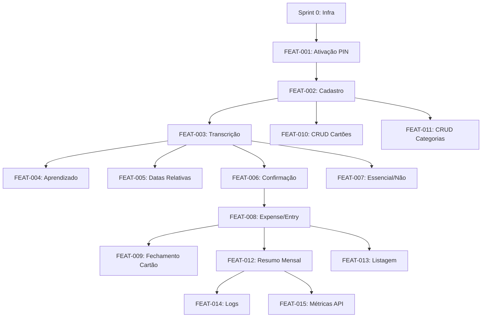

# Progress Tracker V2 — Finance Bot Telegram

> **Versão compactada para desenvolvimento com IA.** Tarefas agrupadas logicamente para reduzir granularidade e otimizar uso de contexto.

---

## Legenda

| Símbolo | Status | Descrição |
|---------|--------|-----------|
| ⏳ | PENDING | Não iniciado |
| 🔄 | IN_PROGRESS | Em desenvolvimento |
| ✅ | DONE | Concluído e validado (DOD completo) |
| 🚫 | BLOCKED | Bloqueado por dependência |
| ⏸️ | PAUSED | Pausado (motivo documentado) |

---

## Visão Geral

```
Sprint 0: Infra ────────────────────────────────────┐
                                                    ▼
Sprint 1: Auth (FEAT-001) ──────────────────────────┤
                                                    ▼
Sprint 2: Onboarding (FEAT-002, 010, 011) ──────────┤
                                                    ▼
Sprint 3: Core Audio (FEAT-003, 005) ───────────────┤
                                                    ▼
Sprint 4: Categorização (FEAT-004, 006, 007) ───────┤
                                                    ▼
Sprint 5: Financeiro (FEAT-008, 009) ───────────────┤
                                                    ▼
Sprint 6: Relatórios (FEAT-012, 013) ───────────────┤
                                                    ▼
Sprint 7: Observabilidade (FEAT-014, 015) ──────────┘
```

---

## Grafo de Dependências



---

## Sprint 0: Infraestrutura ⏳

**Objetivo:** Setup inicial do projeto, ambiente de desenvolvimento funcional.

**Dependências:** Nenhuma (ponto de entrada)

### Tarefas

| ID | Task | Status | Branch | Dependência | DOD |
|----|------|--------|--------|-------------|-----|
| INFRA-001 | Setup projeto completo: estrutura de diretórios, Docker Compose (bot + postgres), python-telegram-bot básico, .env.example | ✅ | `chore/infra-completa` | - | [x] |
| INFRA-002 | Configurar SQLModel + Alembic + pytest com fixtures | ✅ | `chore/database-testing` | INFRA-001 | [x] |
| INFRA-003 | Configurar ferramentas de qualidade: ruff + mypy | ⏳ | `chore/linting-setup` | INFRA-001 | [ ] |

**Detalhamento INFRA-001:**
- Criar estrutura de diretórios (src/, tests/, migrations/, etc.)
- Docker Compose com serviços: bot (Python), postgres
- Configurar python-telegram-bot com handler básico /start
- Criar .env.example com todas variáveis necessárias

**Detalhamento INFRA-002:**
- Configurar SQLModel com engine e session
- Setup Alembic para migrations
- Configurar pytest com fixtures para DB e bot
- Criar estrutura base de testes

**Detalhamento INFRA-003:**
- Configurar ruff para linting e formatação
- Configurar mypy para type checking
- Adicionar pre-commit hooks (opcional)

### Critérios de Saída Sprint 0

- [x] `docker compose up -d` sobe bot + postgres sem erros
- [x] `pytest tests/` executa (mesmo sem testes reais)
- [ ] `ruff check . && mypy .` passa
- [x] Bot responde a /start com mensagem placeholder

---

## Sprint 1: Autenticação (FEAT-001) ⏳

**Objetivo:** Usuário pode criar PIN e autenticar-se.

**Dependências:** Sprint 0 completo

**Documentação:**
- PRD: FEAT-001 (linhas 57-103)
- Regras: RULE-007 (bloqueio 3 tentativas), RULE-008 (sessão 24h)

### Tarefas

| ID | Task | Status | Branch | Dependência | DOD |
|----|------|--------|--------|-------------|-----|
| AUTH-001 | Modelo User + migration + hash bcrypt (cost=12) | ⏳ | `feat/FEAT-001-user-model` | INFRA-002 | [ ] |
| AUTH-002 | Handler /start: novo usuário → criação PIN (ConversationHandler) | ⏳ | `feat/FEAT-001-start-handler` | AUTH-001 | [ ] |
| AUTH-003 | Handler login: usuário existente + bloqueio (3 tentativas, 15min) + sessão (24h) | ⏳ | `feat/FEAT-001-login-handler` | AUTH-001 | [ ] |

**Detalhamento AUTH-001:**
- Criar modelo User (SQLModel) com campos: id, telegram_id, pin_hash, failed_attempts, locked_until, last_login
- Migration inicial para tabela users
- Service para hash/verificação PIN com bcrypt (cost=12)

**Detalhamento AUTH-002:**
- Handler /start detecta usuário novo vs existente
- ConversationHandler para criação de PIN (solicita PIN, confirma PIN)
- Validação PIN: 4-6 dígitos numéricos
- Após criação bem-sucedida, inicia wizard de onboarding

**Detalhamento AUTH-003:**
- Handler para login de usuário existente (solicita PIN)
- Lógica de bloqueio: incrementa failed_attempts, bloqueia após 3 erros por 15min
- Sistema de sessão: armazena last_login, valida expiração (24h)
- Códigos de erro: AUTH.INVALID_PIN, AUTH.ACCOUNT_LOCKED, AUTH.SESSION_EXPIRED

### Testes (PRD)

| TEST ID | Cenário | Prioridade | Status | Implementado em |
|---------|---------|------------|--------|-----------------|
| TEST-001 | Criação de PIN válido | P0 | ⏳ | AUTH-002 |
| TEST-002 | PIN formato inválido | P0 | ⏳ | AUTH-002 |
| TEST-003 | Bloqueio após tentativas | P0 | ⏳ | AUTH-003 |

### Critérios de Saída Sprint 1

- [ ] Novo usuário consegue criar PIN
- [ ] Usuário existente faz login com PIN
- [ ] Conta bloqueia após 3 erros
- [ ] Todos os TEST-00X passam
- [ ] Códigos de erro AUTH.* funcionam

---

## Sprint 2: Onboarding (FEAT-002, 010, 011) ⏳

**Objetivo:** Cadastro de cartões e categorias.

**Dependências:** Sprint 1 completo

**Documentação:**
- PRD: FEAT-002 (linhas 107-158), FEAT-010, FEAT-011
- Regra: RULE-001 (validação cartão)

### Tarefas

| ID | Task | Status | Branch | Dependência | DOD |
|----|------|--------|--------|-------------|-----|
| ONBOARD-001 | Modelos Card e Category + migrations + seed categorias padrão | ⏳ | `feat/FEAT-002-models` | AUTH-001 | [ ] |
| ONBOARD-002 | CRUD completo de cartões: /add_cartao, /list_cartoes, /delete_cartao + validações (RULE-001) | ⏳ | `feat/FEAT-010-crud-cartoes` | ONBOARD-001 | [ ] |
| ONBOARD-003 | CRUD de categorias: /add_categoria, /list_categorias, /delete_categoria | ⏳ | `feat/FEAT-011-crud-categorias` | ONBOARD-001 | [ ] |
| ONBOARD-004 | Wizard de onboarding pós-PIN (guia cadastro cartão) | ⏳ | `feat/FEAT-002-wizard` | ONBOARD-002, AUTH-002 | [ ] |

**Detalhamento ONBOARD-001:**
- Modelo Card: id, user_id, name, last_digits (4 dígitos), closing_day (1-31), due_day (1-31), deleted_at (soft delete)
- Modelo Category: id, user_id, name, is_default
- Migrations para tabelas cards e categories
- Seed: criar categorias padrão (Alimentação, Transporte, Lazer, Moradia, Assinaturas, Saúde, Outros)

**Detalhamento ONBOARD-002:**
- Handler /add_cartao: ConversationHandler para coletar nome, últimos dígitos, dia fechamento, dia vencimento
- Validações (RULE-001): closing_day/due_day entre 1-31, last_digits exatamente 4 dígitos numéricos
- Handler /list_cartoes: lista cartões ativos do usuário
- Handler /delete_cartao: soft delete (marca deleted_at)
- Códigos de erro: CARD.INVALID_DIGITS, CARD.INVALID_CLOSING_DAY, CARD.DUPLICATE

**Detalhamento ONBOARD-003:**
- Handler /add_categoria: adiciona categoria personalizada
- Handler /list_categorias: lista categorias do usuário (padrão + personalizadas)
- Handler /delete_categoria: exclui categoria (não permite excluir padrão)

**Detalhamento ONBOARD-004:**
- Após criação de PIN bem-sucedida, inicia wizard
- Guia passo a passo para cadastrar primeiro cartão
- Opção de pular e cadastrar depois

### Testes (PRD)

| TEST ID | Cenário | Prioridade | Status | Implementado em |
|---------|---------|------------|--------|-----------------|
| TEST-010 | Cadastro de cartão válido | P0 | ⏳ | ONBOARD-002 |
| TEST-011 | Cartão com dígitos inválidos | P1 | ⏳ | ONBOARD-002 |
| TEST-012 | Dia de fechamento inválido | P1 | ⏳ | ONBOARD-002 |

### Critérios de Saída Sprint 2

- [ ] Usuário cadastra cartão com sucesso
- [ ] Validações de cartão funcionam
- [ ] Categorias padrão criadas automaticamente
- [ ] CRUD de categorias funciona
- [ ] Wizard de onboarding completo

---

## Sprint 3: Core Audio (FEAT-003, 005) ⏳

**Objetivo:** Transcrição de áudio e interpretação de datas.

**Dependências:** Sprint 2 completo

**Documentação:**
- PRD: FEAT-003 (linhas 162-223), FEAT-005 (linhas 262-295)
- Regras: RULE-009 (áudio deletado após 7 dias), RULE-010 (fallback transcrição)

### Tarefas

| ID | Task | Status | Branch | Dependência | DOD |
|----|------|--------|--------|-------------|-----|
| AUDIO-001 | Service Groq Whisper: transcrição de áudio + handler mensagem áudio + validação (max 60s) | ⏳ | `feat/FEAT-003-groq-transcription` | INFRA-001 | [ ] |
| AUDIO-002 | Service Gemini Flash: extração de entidades (valor, descrição, data, categoria) + prompt engineering + parser JSON | ⏳ | `feat/FEAT-003-gemini-extraction` | INFRA-001 | [ ] |
| AUDIO-003 | Interpretação de datas relativas ("ontem", "sábado passado") + validação data não futura + detecção múltiplas despesas | ⏳ | `feat/FEAT-005-date-parsing` | AUDIO-002 | [ ] |
| AUDIO-004 | Fluxo completo: áudio → transcrição → extração → interpretação datas → resumo para confirmação | ⏳ | `feat/FEAT-003-audio-flow` | AUDIO-001, AUDIO-002, AUDIO-003 | [ ] |

**Detalhamento AUDIO-001:**
- Service Groq Whisper: integração com API, transcrição de áudio
- Handler para mensagens de áudio no Telegram
- Validação: duração máxima 60 segundos
- Fallback: se Groq falhar/timeout, tentar alternativa (RULE-010)
- Códigos de erro: AUDIO.TOO_LONG, AUDIO.TRANSCRIPTION_FAILED, AUDIO.FORMAT_NOT_SUPPORTED

**Detalhamento AUDIO-002:**
- Service Gemini Flash: chamada para extração de entidades
- Prompt engineering: instruções claras para extrair valor, descrição, data, categoria sugerida
- Parser de resposta JSON do Gemini
- Detecção se áudio não contém despesa (EXPENSE.NOT_DETECTED)

**Detalhamento AUDIO-003:**
- Parser de datas relativas: "ontem", "hoje", "sábado passado", "última segunda", etc.
- Validação: rejeitar datas futuras (EXPENSE.FUTURE_DATE)
- Detecção de múltiplas despesas no mesmo áudio (ex: "comprei 30 reais em carne e 20 reais em cerveja")

**Detalhamento AUDIO-004:**
- Orquestração completa do fluxo
- Após extração, mostra resumo com botões [Confirmar] [Editar] [Cancelar]
- Tratamento de erros em cada etapa

### Testes (PRD)

| TEST ID | Cenário | Prioridade | Status | Implementado em |
|---------|---------|------------|--------|-----------------|
| TEST-020 | Transcrição simples | P0 | ⏳ | AUDIO-004 |
| TEST-021 | Áudio não relacionado | P1 | ⏳ | AUDIO-002 |
| TEST-022 | Múltiplas despesas | P1 | ⏳ | AUDIO-003 |
| TEST-023 | Áudio muito longo | P1 | ⏳ | AUDIO-001 |
| TEST-024 | Interpretação "ontem" | P0 | ⏳ | AUDIO-003 |
| TEST-025 | "sábado passado" | P1 | ⏳ | AUDIO-003 |
| TEST-026 | Data futura rejeitada | P1 | ⏳ | AUDIO-003 |

### Critérios de Saída Sprint 3

- [ ] Áudio transcrito com sucesso
- [ ] Entidades extraídas (valor, descrição, data)
- [ ] Datas relativas interpretadas corretamente
- [ ] Erros de áudio tratados (muito longo, sem despesa)

---

## Sprint 4: Categorização (FEAT-004, 006, 007) ⏳

**Objetivo:** Categorização inteligente e fluxo de confirmação.

**Dependências:** Sprint 3 completo

**Documentação:**
- PRD: FEAT-004 (linhas 227-258), FEAT-006 (linhas 299-338), FEAT-007 (linhas 342-355)
- Regras: RULE-003 (aprendizado >= 3 confirmações), RULE-005 (normalização), RULE-006 (confiança >= 0.9)

### Tarefas

| ID | Task | Status | Branch | Dependência | DOD |
|----|------|--------|--------|-------------|-----|
| CAT-001 | Sistema de aprendizado: modelo CategoryPattern + migration + normalização descrição + busca histórico (>= 3 confirmações) + fallback LLM + incremento contador | ⏳ | `feat/FEAT-004-learning` | ONBOARD-001, AUDIO-002 | [ ] |
| CAT-002 | Classificação essencial vs não essencial (regras baseadas em categoria e descrição) | ⏳ | `feat/FEAT-007-essential` | AUDIO-002 | [ ] |
| CAT-003 | Fluxo de confirmação completo: resumo com botões inline + callbacks (confirmar/editar/cancelar) + timeout (10min) + highlight campos baixa confiança | ⏳ | `feat/FEAT-006-confirmation` | AUDIO-004, CAT-001, CAT-002 | [ ] |

**Detalhamento CAT-001:**
- Modelo CategoryPattern: id, user_id, normalized_description, category_id, confirmation_count
- Migration para tabela category_patterns
- Service de normalização: lower(unaccent(trim())) (RULE-005)
- Busca no histórico: se normalized_description tem >= 3 confirmações, usa categoria aprendida (RULE-003)
- Fallback: se não encontrar no histórico, chama Gemini Flash para categorização
- Incremento: ao confirmar despesa, incrementa confirmation_count do padrão

**Detalhamento CAT-002:**
- Regras para classificar essencial/não essencial:
  - Alimentação básica (mercado, feira) = Essencial
  - Alimentação supérflua (restaurante, delivery, cerveja) = Não Essencial
  - Transporte trabalho = Essencial
  - Transporte lazer = Não Essencial
  - Moradia (aluguel, contas) = Essencial
  - Assinaturas = Não Essencial
- Integração com extração do Gemini para classificar automaticamente

**Detalhamento CAT-003:**
- Mostrar resumo da despesa extraída com todos campos
- Botões inline: [✅ Confirmar] [✏️ Editar] [❌ Cancelar]
- Callback handlers para cada ação
- Se confiança >= 0.9 (RULE-006): permite confirmação direta
- Se confiança < 0.9: destaca campos com ❓ e botões específicos para edição
- Timeout: após 10 minutos sem resposta, cancela automaticamente (EXPENSE.CONFIRMATION_TIMEOUT)

### Testes (PRD)

| TEST ID | Cenário | Prioridade | Status | Implementado em |
|---------|---------|------------|--------|-----------------|
| TEST-030 | Sugestão baseada em histórico | P1 | ⏳ | CAT-001 |
| TEST-031 | Fallback para LLM | P1 | ⏳ | CAT-001 |
| TEST-032 | Confirmação confiança alta | P0 | ⏳ | CAT-003 |
| TEST-033 | Confirmação confiança baixa | P1 | ⏳ | CAT-003 |
| TEST-034 | Timeout de confirmação | P2 | ⏳ | CAT-003 |

### Critérios de Saída Sprint 4

- [ ] Categorização por histórico funciona
- [ ] Fallback para LLM funciona
- [ ] Fluxo de confirmação completo
- [ ] Aprendizado incrementa contador
- [ ] Classificação essencial/não essencial funciona

---

## Sprint 5: Financeiro (FEAT-008, 009) ⏳

**Objetivo:** Modelo de despesa/lançamento e cálculo de faturas.

**Dependências:** Sprint 4 completo

**Documentação:**
- PRD: FEAT-008 (linhas 358-391), FEAT-009 (linhas 394-428)
- Regras: RULE-002 (state machine), RULE-004 (cálculo vencimento)

### Tarefas

| ID | Task | Status | Branch | Dependência | DOD |
|----|------|--------|--------|-------------|-----|
| FIN-001 | Modelos Expense e Entry + migrations + state machine (pending → paid/cancelled) | ⏳ | `feat/FEAT-008-models` | ONBOARD-001, ONBOARD-002 | [ ] |
| FIN-002 | Services: criar despesa à vista (1 entry) + criar despesa parcelada (N entries) + cálculo vencimentos baseado em fechamento (RULE-004) | ⏳ | `feat/FEAT-008-009-expense-services` | FIN-001 | [ ] |
| FIN-003 | Integração: confirmação de despesa → criar Expense + Entries | ⏳ | `feat/FEAT-008-confirm-integration` | CAT-003, FIN-002 | [ ] |

**Detalhamento FIN-001:**
- Modelo Expense: id, user_id, description, total_amount, category_id, is_essential, card_id, payment_method, created_at
- Modelo Entry: id, expense_id, installment_number, amount, due_date, competence_month, status (pending/paid/cancelled)
- Migrations para tabelas expenses e entries
- State machine para Entry: transições válidas pending → paid/cancelled (RULE-002)
- Código de erro: ENTRY.INVALID_TRANSITION

**Detalhamento FIN-002:**
- Service criar despesa à vista: cria 1 Expense + 1 Entry com due_date = data da despesa
- Service criar despesa parcelada: cria 1 Expense + N Entries (uma por parcela)
- Cálculo de vencimento (RULE-004):
  - Se compra antes do fechamento: 1ª parcela vence no próximo vencimento do cartão
  - Se compra após fechamento: 1ª parcela vence no vencimento do mês seguinte
  - Competência: mês do vencimento
  - Tratamento especial para fechamento no fim do mês

**Detalhamento FIN-003:**
- Ao confirmar despesa no fluxo de confirmação:
  - Cria Expense com todos dados extraídos/editados
  - Identifica cartão selecionado (ou padrão)
  - Identifica se é débito (à vista) ou crédito (parcelado)
  - Chama service apropriado para criar Entries
  - Retorna confirmação ao usuário

### Testes (PRD)

| TEST ID | Cenário | Prioridade | Status | Implementado em |
|---------|---------|------------|--------|-----------------|
| TEST-040 | Despesa à vista (débito) | P0 | ⏳ | FIN-002 |
| TEST-041 | Despesa parcelada em 3x | P0 | ⏳ | FIN-002 |
| TEST-042 | Compra antes do fechamento | P0 | ⏳ | FIN-002 |
| TEST-043 | Compra após fechamento | P0 | ⏳ | FIN-002 |
| TEST-044 | Fechamento fim do mês | P1 | ⏳ | FIN-002 |

### Critérios de Saída Sprint 5

- [ ] Despesa à vista cria 1 entry
- [ ] Despesa parcelada cria N entries
- [ ] Vencimentos calculados corretamente
- [ ] State machine funciona
- [ ] Integração com confirmação funciona

---

## Sprint 6: Relatórios (FEAT-012, 013) ⏳

**Objetivo:** Resumo mensal e listagem de despesas.

**Dependências:** Sprint 5 completo

**Documentação:**
- PRD: FEAT-012 (linhas 458-502), FEAT-013 (linhas 506-514)

### Tarefas

| ID | Task | Status | Branch | Dependência | DOD |
|----|------|--------|-------------|-------------|-----|
| REP-001 | Handler /despesas: listar despesas do mês atual ou MM/YYYY | ⏳ | `feat/FEAT-013-despesas` | FIN-001 | [ ] |
| REP-002 | Service resumo mensal: cálculo totais + essenciais vs não essenciais + agrupamento por categoria + comparativo mês anterior | ⏳ | `feat/FEAT-012-resumo-service` | FIN-001 | [ ] |
| REP-003 | Handler /resumo: exibir resumo mensal (mês atual ou MM/YYYY) | ⏳ | `feat/FEAT-012-resumo-handler` | REP-002 | [ ] |

**Detalhamento REP-001:**
- Handler /despesas: lista despesas do mês atual
- Handler /despesas MM/YYYY: lista despesas de mês específico
- Formato: lista paginada com descrição, valor, categoria, data
- Tratamento: REPORT.NO_DATA se não houver despesas

**Detalhamento REP-002:**
- Cálculo de totais: soma de todas despesas do mês
- Separação essenciais vs não essenciais: percentuais e valores
- Agrupamento por categoria: total por categoria
- Comparativo mês anterior: diferença percentual e absoluta (se houver dados)
- Formatação de saída: texto estruturado para Telegram

**Detalhamento REP-003:**
- Handler /resumo: exibe resumo do mês atual
- Handler /resumo MM/YYYY: exibe resumo de mês específico
- Validação: REPORT.INVALID_MONTH se formato inválido
- Formato de saída:
  ```
  📊 Resumo Fevereiro/2026
  
  💰 Total: R$ 280,00
  ✅ Essenciais: R$ 200,00 (71%)
  ❌ Não essenciais: R$ 80,00 (29%)
  
  📁 Por categoria:
  • Alimentação: R$ 200,00
  • Lazer: R$ 50,00
  • Transporte: R$ 30,00
  ```

### Testes (PRD)

| TEST ID | Cenário | Prioridade | Status | Implementado em |
|---------|---------|------------|--------|-----------------|
| TEST-050 | Geração resumo mensal | P1 | ⏳ | REP-003 |
| TEST-051 | Resumo sem dados | P2 | ⏳ | REP-003 |

### Critérios de Saída Sprint 6

- [ ] /despesas lista despesas do mês
- [ ] /resumo mostra totais por categoria
- [ ] Percentuais essencial/não essencial corretos
- [ ] Comparativo com mês anterior

---

## Sprint 7: Observabilidade (FEAT-014, 015) ⏳

**Objetivo:** Logs estruturados e métricas de API.

**Dependências:** Sprint 6 completo

**Documentação:**
- PRD: FEAT-014, FEAT-015

### Tarefas

| ID | Task | Status | Branch | Dependência | DOD |
|----|------|--------|--------|-------------|-----|
| OBS-001 | Setup structlog + logs estruturados: autenticação + transcrição (sem conteúdo sensível) | ⏳ | `feat/FEAT-014-logs` | INFRA-001 | [ ] |
| OBS-002 | Sistema de métricas API: modelo ApiMetric + migration + decorator + captura métricas Groq e Gemini (latência, tokens, custo) | ⏳ | `feat/FEAT-015-metrics` | FIN-001, AUDIO-001, AUDIO-002 | [ ] |
| OBS-003 | Handler /metricas (dev only): exibir métricas de uso de APIs | ⏳ | `feat/FEAT-015-metrics-handler` | OBS-002 | [ ] |

**Detalhamento OBS-001:**
- Setup structlog com formato JSON estruturado
- Logs de autenticação: tentativas de login, bloqueios, criação de PIN (sem PIN em texto)
- Logs de transcrição: início/fim, duração, sucesso/erro (sem conteúdo do áudio ou transcrição)
- Nenhum dado sensível nos logs (conforme SECURITY)

**Detalhamento OBS-002:**
- Modelo ApiMetric: id, user_id, provider (groq/gemini), endpoint, latency_ms, tokens_input, tokens_output, cost_usd, created_at
- Migration para tabela api_metrics
- Decorator para capturar métricas automaticamente em chamadas de API
- Integração com services Groq e Gemini para capturar latência, tokens, custo estimado
- Cálculo de custo baseado em pricing das APIs

**Detalhamento OBS-003:**
- Handler /metricas: exibe resumo de métricas de APIs (apenas para desenvolvimento)
- Métricas: total de chamadas, latência média, tokens totais, custo estimado
- Filtros: por provider, por período

### Critérios de Saída Sprint 7

- [ ] Logs estruturados funcionando
- [ ] Métricas de API coletadas
- [ ] Custo estimado por chamada
- [ ] Nenhum dado sensível nos logs
- [ ] Handler /metricas funcional

---

## Resumo de Progresso

### Por Sprint

| Sprint | Total Tasks | Done | Progress |
|--------|-------------|------|----------|
| Sprint 0: Infra | 3 | 2 | 67% |
| Sprint 1: Auth | 3 | 0 | 0% |
| Sprint 2: Onboarding | 4 | 0 | 0% |
| Sprint 3: Core Audio | 4 | 0 | 0% |
| Sprint 4: Categorização | 3 | 0 | 0% |
| Sprint 5: Financeiro | 3 | 0 | 0% |
| Sprint 6: Relatórios | 3 | 0 | 0% |
| Sprint 7: Observabilidade | 3 | 0 | 0% |
| **TOTAL** | **26** | **2** | **8%** |

### Por Prioridade de Testes

| Prioridade | Total | Done | Restante |
|------------|-------|------|----------|
| P0 (Crítico) | 12 | 0 | 12 |
| P1 (Importante) | 13 | 0 | 13 |
| P2 (Nice to have) | 2 | 0 | 2 |
| **TOTAL** | **27** | **0** | **27** |

---

## Histórico de Atualizações

| Data | Sprint | Task | De | Para | Notas |
|------|--------|------|----|------|-------|
| 2026-02-09 | Sprint 0: Infra | INFRA-002 | 🔄 | ✅ | DOD completo |
| 2026-02-09 | Sprint 0: Infra | INFRA-002 | ⏳ | 🔄 | Iniciando: Configurar SQLModel + Alembic + pytest |
| 2026-02-09 | Sprint 0: Infra | INFRA-001 | 🔄 | ✅ | DOD completo |
| 2026-02-09 | Sprint 0: Infra | INFRA-001 | ⏳ | 🔄 | Iniciando: Setup projeto completo |
| 2026-02-09 | - | - | - | - | Versão V2 criada - compactação de 77 para 26 tasks |

---

## Notas

### Bloqueios Atuais

_Nenhum bloqueio registrado._

### Decisões Pendentes

_Nenhuma decisão pendente._

### Riscos Identificados

| Risco | Impacto | Mitigação |
|-------|---------|-----------|
| API Groq indisponível | Alto | Retry + mensagem amigável |
| Custo APIs excede budget | Médio | Métricas + alertas |

---