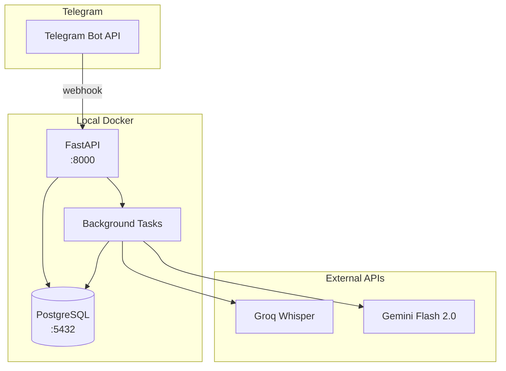
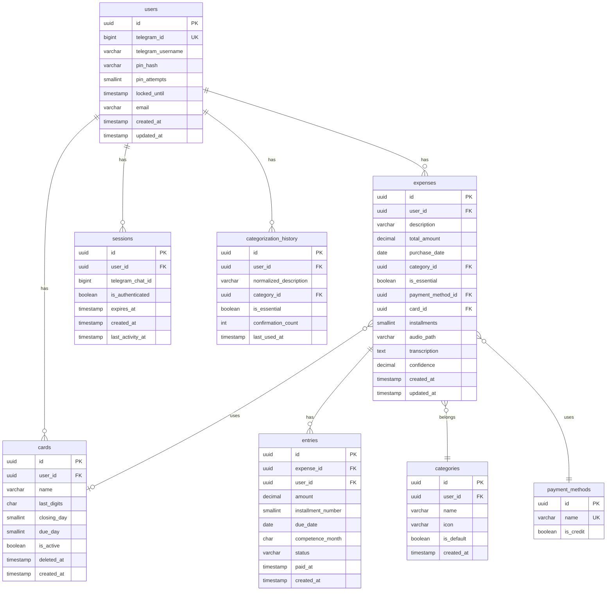
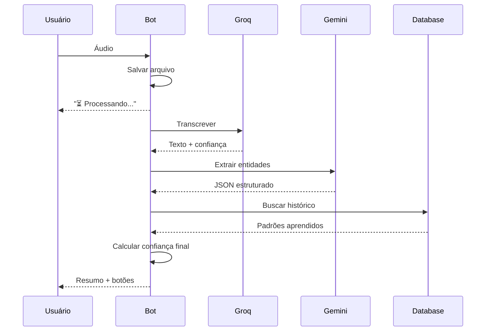

# Tech Specs — Finance Bot Telegram

> **Resumo executivo:** Especificação técnica do bot Telegram para registro de despesas via áudio. Stack: Python 3.11+, FastAPI, SQLModel, PostgreSQL. Integrações: Groq Whisper (transcrição), Gemini Flash (NER). Arquitetura monolito modular com background tasks nativo.

---

## 1. Arquitetura

### Diagrama de Componentes



### Componentes

| Componente | Responsabilidade | Tecnologia | Versão |
|------------|------------------|------------|--------|
| API Server | Webhook Telegram, handlers | FastAPI | 0.109+ |
| Bot Handler | Comandos e callbacks | python-telegram-bot | 21+ |
| Background Tasks | Transcrição, categorização | FastAPI BackgroundTasks | Nativo |
| Database | Persistência | PostgreSQL | 16+ |
| ORM | Mapeamento objeto-relacional | SQLModel | 0.0.14+ |
| Migrations | Versionamento de schema | Alembic | 1.13+ |
| Transcription | Áudio → texto | Groq Whisper Large | API |
| NER/Categorization | Extração de entidades | Gemini Flash 2.0 | API |

---

## 2. Modelo de Dados

### Diagrama ER



### Entidade: User

```json
{
  "$schema": "http://json-schema.org/draft-07/schema#",
  "type": "object",
  "properties": {
    "id": { "type": "string", "format": "uuid" },
    "telegram_id": { 
      "type": "integer",
      "x-pii": true,
      "description": "ID único do Telegram"
    },
    "telegram_username": {
      "type": "string",
      "maxLength": 255,
      "x-pii": true
    },
    "pin_hash": {
      "type": "string",
      "maxLength": 255,
      "description": "Hash bcrypt do PIN"
    },
    "pin_attempts": {
      "type": "integer",
      "default": 0,
      "minimum": 0
    },
    "locked_until": {
      "type": "string",
      "format": "date-time",
      "nullable": true
    },
    "email": {
      "type": "string",
      "format": "email",
      "x-pii": true,
      "nullable": true
    }
  },
  "required": ["id", "telegram_id", "pin_hash"]
}
```

### Entidade: Card

```json
{
  "$schema": "http://json-schema.org/draft-07/schema#",
  "type": "object",
  "properties": {
    "id": { "type": "string", "format": "uuid" },
    "user_id": { "type": "string", "format": "uuid" },
    "name": {
      "type": "string",
      "minLength": 1,
      "maxLength": 100,
      "x-normalize": ["trim"]
    },
    "last_digits": {
      "type": "string",
      "pattern": "^\\d{4}$",
      "x-pii": true
    },
    "closing_day": {
      "type": "integer",
      "minimum": 1,
      "maximum": 31
    },
    "due_day": {
      "type": "integer",
      "minimum": 1,
      "maximum": 31
    },
    "is_active": {
      "type": "boolean",
      "default": true
    },
    "deleted_at": {
      "type": "string",
      "format": "date-time",
      "nullable": true
    }
  },
  "required": ["id", "user_id", "name", "last_digits", "closing_day", "due_day"]
}
```

### Entidade: Expense

```json
{
  "$schema": "http://json-schema.org/draft-07/schema#",
  "type": "object",
  "properties": {
    "id": { "type": "string", "format": "uuid" },
    "user_id": { "type": "string", "format": "uuid" },
    "description": {
      "type": "string",
      "minLength": 1,
      "maxLength": 255
    },
    "total_amount": {
      "type": "number",
      "minimum": 0.01,
      "x-pii": true
    },
    "purchase_date": {
      "type": "string",
      "format": "date"
    },
    "category_id": { "type": "string", "format": "uuid" },
    "is_essential": {
      "type": "boolean",
      "default": false
    },
    "payment_method_id": { "type": "string", "format": "uuid" },
    "card_id": {
      "type": "string",
      "format": "uuid",
      "nullable": true
    },
    "installments": {
      "type": "integer",
      "minimum": 1,
      "maximum": 48,
      "default": 1
    },
    "confidence": {
      "type": "number",
      "minimum": 0,
      "maximum": 1,
      "nullable": true
    }
  },
  "required": ["id", "user_id", "description", "total_amount", "purchase_date", "category_id", "payment_method_id"]
}
```

### Entidade: Entry

```json
{
  "$schema": "http://json-schema.org/draft-07/schema#",
  "type": "object",
  "properties": {
    "id": { "type": "string", "format": "uuid" },
    "expense_id": { "type": "string", "format": "uuid" },
    "user_id": { "type": "string", "format": "uuid" },
    "amount": {
      "type": "number",
      "minimum": 0.01,
      "x-pii": true
    },
    "installment_number": {
      "type": "integer",
      "minimum": 1
    },
    "due_date": {
      "type": "string",
      "format": "date"
    },
    "competence_month": {
      "type": "string",
      "pattern": "^\\d{4}-\\d{2}$"
    },
    "status": {
      "type": "string",
      "enum": ["pending", "paid", "cancelled"],
      "default": "pending"
    },
    "paid_at": {
      "type": "string",
      "format": "date-time",
      "nullable": true
    }
  },
  "required": ["id", "expense_id", "user_id", "amount", "installment_number", "due_date", "competence_month", "status"]
}
```

---

## 3. Contrato de API (Comandos Telegram)

### API-001: /start — Início e Onboarding

- **FEAT:** FEAT-001, FEAT-002
- **Trigger:** Comando `/start`
- **Auth:** Nenhuma (cria sessão)

#### Fluxo

```
1. Verificar se usuário existe
2. Se NÃO existe → Criar usuário, solicitar PIN
3. Se existe e sessão expirada → Solicitar PIN
4. Se existe e sessão válida → Responder "Já autenticado"
```

#### Response (novo usuário)

```
👋 Bem-vindo ao Finance Bot!

Vamos configurar sua conta. Primeiro, crie um PIN de 4-6 dígitos.

Digite seu PIN:
```

#### Response (erro)

```json
{
  "code": "AUTH.INVALID_PIN",
  "message": "PIN deve ter 4-6 dígitos numéricos",
  "severity": "WARNING",
  "traceId": "uuid-v4"
}
```

---

### API-002: PIN Validation — Validar PIN

- **FEAT:** FEAT-001
- **Trigger:** Mensagem de texto quando aguardando PIN
- **Auth:** Sessão pendente

#### Validações

| Campo | Tipo | Obrigatório | Limites | Normalização | Erro |
|-------|------|-------------|---------|--------------|------|
| pin | string | sim | 4-6 chars | trim | AUTH.INVALID_PIN |

#### Response (bloqueio)

```json
{
  "code": "AUTH.ACCOUNT_LOCKED",
  "message": "Conta bloqueada. Tente novamente em 15 minutos.",
  "severity": "ERROR",
  "traceId": "uuid-v4"
}
```

---

### API-003: /add_cartao — Adicionar Cartão

- **FEAT:** FEAT-002, FEAT-010
- **Trigger:** Comando `/add_cartao`
- **Auth:** Sessão autenticada

#### Validações

| Campo | Tipo | Obrigatório | Limites | Normalização | Erro |
|-------|------|-------------|---------|--------------|------|
| name | string | sim | 1-100 | trim | CARD.NAME_REQUIRED |
| last_digits | string | sim | 4 chars | - | CARD.INVALID_DIGITS |
| closing_day | int | sim | 1-31 | - | CARD.INVALID_CLOSING_DAY |
| due_day | int | sim | 1-31 | - | CARD.INVALID_DUE_DAY |

#### Response (sucesso)

```
✅ Cartão cadastrado!

💳 Nubank (*1234)
📅 Fechamento: dia 10
📅 Vencimento: dia 18
```

#### Response (erro)

```json
{
  "code": "CARD.VALIDATION_ERROR",
  "message": "Dados inválidos",
  "severity": "WARNING",
  "details": [
    { "field": "last_digits", "code": "INVALID_FORMAT", "message": "Digite 4 dígitos" }
  ],
  "traceId": "uuid-v4"
}
```

---

### API-004: Audio Handler — Processar Áudio

- **FEAT:** FEAT-003, FEAT-004, FEAT-005, FEAT-006, FEAT-007
- **Trigger:** Mensagem de áudio/voice
- **Auth:** Sessão autenticada
- **Async:** Sim (Background Task)

#### Fluxo



#### Request (extração)

```json
{
  "audio_format": ".ogg | .mp3 | .m4a",
  "max_duration_seconds": 60
}
```

#### Response (extração)

```json
{
  "confidence": 0.92,
  "expenses": [
    {
      "description": "Uber",
      "amount": 30.00,
      "date": "2026-02-01",
      "category_suggestion": "Transporte",
      "is_essential": false,
      "payment_method": "Débito",
      "card_hint": null,
      "installments": 1
    }
  ]
}
```

#### Response (erro)

```json
{
  "code": "AUDIO.TRANSCRIPTION_FAILED",
  "message": "Não consegui transcrever. Tente novamente.",
  "severity": "ERROR",
  "traceId": "uuid-v4"
}
```

---

### API-005: Callback Confirm — Confirmar Despesa

- **FEAT:** FEAT-006, FEAT-008, FEAT-009
- **Trigger:** Callback `confirm_expense:{id}`
- **Auth:** Sessão autenticada

#### Algoritmo de Vencimento (RULE-004)

```python
def calcular_vencimento(purchase_date: date, closing_day: int, due_day: int) -> date:
    """
    Se compra <= dia_fechamento: entra na fatura do mês seguinte
    Se compra > dia_fechamento: entra na fatura do mês + 2
    """
    if purchase_date.day <= closing_day:
        due_month = purchase_date.month + 1
    else:
        due_month = purchase_date.month + 2
    
    # Ajustar ano se mês > 12
    due_year = purchase_date.year + (due_month - 1) // 12
    due_month = ((due_month - 1) % 12) + 1
    
    # Ajustar dia se mês não tem dia suficiente
    from calendar import monthrange
    max_day = monthrange(due_year, due_month)[1]
    actual_due_day = min(due_day, max_day)
    
    return date(due_year, due_month, actual_due_day)
```

---

### API-006: /resumo — Resumo Mensal

- **FEAT:** FEAT-012
- **Trigger:** Comando `/resumo` ou `/resumo <mes>`
- **Auth:** Sessão autenticada

#### Request

| Parâmetro | Tipo | Obrigatório | Default | Formato |
|-----------|------|-------------|---------|---------|
| mes | string | não | Mês atual | "02/2026" ou "fevereiro" |

#### Response

```
📊 Resumo de Fevereiro/2026

💰 Total gasto: R$2.450,00

🏷️ Por categoria:
• Alimentação: R$800,00 (32%)
  ├─ Essencial: R$650,00
  └─ Não Essencial: R$150,00
• Transporte: R$400,00 (16%)

📈 vs Janeiro: +12% (+R$260)

[Ver despesas] [Exportar CSV]
```

---

### API-007: /despesas — Listagem de Despesas

- **FEAT:** FEAT-013
- **Trigger:** Comando `/despesas` ou `/despesas <mes>`
- **Auth:** Sessão autenticada
- **Paginação:** Offset-based, 10 por página

#### Paginação

| Parâmetro | Mínimo | Máximo | Default |
|-----------|--------|--------|---------|
| page | 1 | - | 1 |
| per_page | 1 | 50 | 10 |

---

### API-008: /fatura — Visualizar Fatura

- **FEAT:** FEAT-009
- **Trigger:** Comando `/fatura <cartao> <mes>`
- **Auth:** Sessão autenticada

---

## 4. Integrações Externas

| Integração | Tipo | Timeout | Retries | Fallback |
|------------|------|---------|---------|----------|
| Groq Whisper | REST API | 30s | 2 | OpenAI Whisper (só em erro) |
| Gemini Flash 2.0 | REST API | 15s | 2 | - |
| Telegram Bot API | Webhook | - | - | - |

### Groq Whisper

```python
# Endpoint
POST https://api.groq.com/openai/v1/audio/transcriptions

# Headers
Authorization: Bearer {GROQ_API_KEY}

# Request
multipart/form-data:
  - file: audio.ogg
  - model: whisper-large-v3
  - language: pt

# Response
{
  "text": "Gastei trinta reais no Uber",
  "language": "pt"
}

# Custo
~$0.04/minuto de áudio
```

### Gemini Flash 2.0

```python
# Endpoint
POST https://generativelanguage.googleapis.com/v1beta/models/gemini-2.0-flash:generateContent

# Request
{
  "contents": [{
    "parts": [{
      "text": "Extraia as despesas do texto: '{transcription}'\n\nRetorne JSON com: description, amount, date, category_suggestion, is_essential"
    }]
  }]
}

# Custo
~$0.075/1M tokens entrada
~$0.30/1M tokens saída
```

---

## 5. Requisitos Não-Funcionais

| Requisito | Valor | Perfil | Como validar |
|-----------|-------|--------|--------------|
| Tempo transcrição | <3s | PESSOAL | Logs de processing_time_ms |
| Tempo categorização | <1s | PESSOAL | Logs de processing_time_ms |
| Tempo consulta resumo | <500ms | PESSOAL | Métricas de resposta |
| Cobertura de testes | 40% | PESSOAL | pytest --cov |
| Uptime | - | PESSOAL | N/A (local) |

---

## 6. Estratégia de Testes

| FEAT | TEST IDs | Tipo | Cenários |
|------|----------|------|----------|
| FEAT-001 | TEST-001, TEST-002, TEST-003 | integration | PIN válido, inválido, bloqueio |
| FEAT-002 | TEST-010, TEST-011 | integration | Cartão válido, dígitos inválidos |
| FEAT-003 | TEST-020, TEST-021, TEST-022 | integration | Transcrição, sem despesa, múltiplas |
| FEAT-004 | TEST-030 | integration | Aprendizado |
| FEAT-005 | TEST-023, TEST-024 | unit | Data relativa, futura |
| FEAT-008 | TEST-042 | integration | Parcelas |
| FEAT-009 | TEST-040, TEST-041 | unit | Vencimento antes/após |
| FEAT-012 | TEST-050 | integration | Resumo mensal |

### Cobertura por Tipo

| Tipo | Quantidade | Prioridade |
|------|------------|------------|
| Unit | 4 | P0 |
| Integration | 11 | P0/P1 |
| E2E | 0 | N/A (PESSOAL) |

---

## 7. Matriz de Rastreabilidade

| FEAT | RULE | API | TEST | ADR |
|------|------|-----|------|-----|
| FEAT-001 | RULE-007, RULE-008 | API-001, API-002 | TEST-001, TEST-002, TEST-003 | ADR-007 |
| FEAT-002 | RULE-001 | API-001, API-003 | TEST-010, TEST-011 | - |
| FEAT-003 | RULE-009, RULE-010 | API-004 | TEST-020, TEST-021, TEST-022 | ADR-005, ADR-006 |
| FEAT-004 | RULE-003, RULE-005 | API-004 | TEST-030 | - |
| FEAT-005 | - | API-004 | TEST-023, TEST-024 | - |
| FEAT-006 | RULE-006 | API-004, API-005 | - | - |
| FEAT-007 | - | API-004 | TEST-022 | - |
| FEAT-008 | RULE-002 | API-005 | TEST-042 | ADR-008 |
| FEAT-009 | RULE-004 | API-005, API-008 | TEST-040, TEST-041 | - |
| FEAT-010 | RULE-001 | API-003 | TEST-010, TEST-011 | - |
| FEAT-012 | - | API-006 | TEST-050 | - |
| FEAT-013 | - | API-007 | - | - |

---

## 8. Mapa de Erros Consolidado

| Code | Severity | HTTP | Quando | Exemplo |
|------|----------|------|--------|---------|
| AUTH.INVALID_PIN | WARNING | - | PIN formato inválido | "abc123" |
| AUTH.PIN_MISMATCH | WARNING | - | Confirmação diferente | "123456" vs "654321" |
| AUTH.ACCOUNT_LOCKED | ERROR | - | 3 tentativas erradas | Bloqueio 15min |
| AUTH.SESSION_EXPIRED | WARNING | - | 24h inatividade | Solicita PIN |
| CARD.NAME_REQUIRED | WARNING | - | Nome vazio | "" |
| CARD.INVALID_DIGITS | WARNING | - | Não numérico | "12AB" |
| CARD.INVALID_CLOSING_DAY | WARNING | - | Fora 1-31 | 32 |
| CARD.NOT_FOUND | WARNING | - | ID inexistente | UUID inválido |
| CARD.DUPLICATE | WARNING | - | Nome duplicado | "Nubank" já existe |
| AUDIO.FORMAT_NOT_SUPPORTED | WARNING | - | Formato inválido | .wav |
| AUDIO.TOO_LONG | WARNING | - | > 60 segundos | 120s |
| AUDIO.TRANSCRIPTION_FAILED | ERROR | - | Groq + fallback falhou | Timeout |
| EXPENSE.NOT_DETECTED | INFO | - | Sem despesa | "Oi, tudo bem?" |
| EXPENSE.FUTURE_DATE | WARNING | - | Data futura | "amanhã" |
| REPORT.INVALID_MONTH | WARNING | - | Mês inválido | "abc" |
| REPORT.NO_DATA | INFO | - | Sem dados | Mês sem despesas |
| ENTRY.INVALID_TRANSITION | WARNING | - | Transição inválida | paid → pending |
