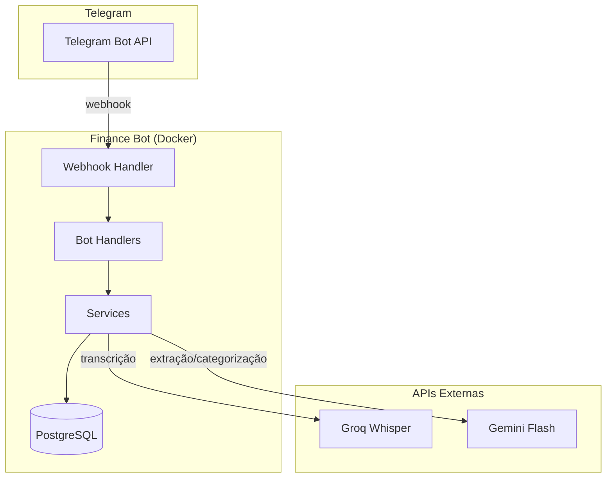
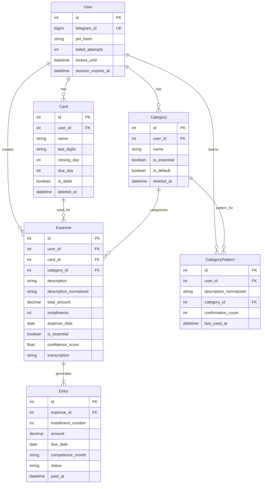
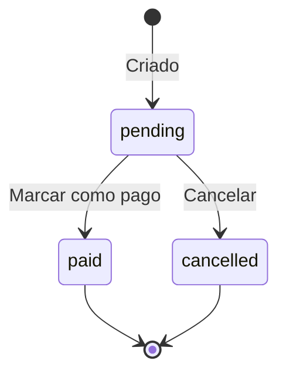

# Tech Specs — Finance Bot Telegram

> **Resumo executivo:** Especificação técnica do Finance Bot, incluindo modelos de dados SQLModel, contratos de API (endpoints internos e handlers Telegram), integrações externas (Groq, Gemini) e estratégia de testes.

---

## 1. Arquitetura

### Diagrama



### Componentes

| Componente | Responsabilidade | Tecnologia |
|------------|------------------|------------|
| Webhook Handler | Receber updates do Telegram | FastAPI |
| Bot Handlers | Processar comandos e mensagens | python-telegram-bot |
| Transcription Service | Transcrever áudio | Groq Whisper API |
| Extraction Service | Extrair entidades do texto | Gemini Flash API |
| Learning Service | Aprendizado de padrões | SQLModel + PostgreSQL |
| Database | Persistência | PostgreSQL 16 |

---

## 2. Modelo de Dados

### Entidade: User

```json
{
  "$schema": "http://json-schema.org/draft-07/schema#",
  "type": "object",
  "properties": {
    "id": { "type": "integer", "description": "PK autoincrement" },
    "telegram_id": { "type": "integer", "description": "ID único do Telegram" },
    "pin_hash": { "type": "string", "description": "PIN hasheado com bcrypt" },
    "failed_attempts": { "type": "integer", "default": 0 },
    "locked_until": { "type": "string", "format": "date-time", "nullable": true },
    "session_expires_at": { "type": "string", "format": "date-time", "nullable": true },
    "created_at": { "type": "string", "format": "date-time" },
    "updated_at": { "type": "string", "format": "date-time" }
  },
  "required": ["telegram_id", "pin_hash"]
}
```

### Entidade: Card

```json
{
  "$schema": "http://json-schema.org/draft-07/schema#",
  "type": "object",
  "properties": {
    "id": { "type": "integer" },
    "user_id": { "type": "integer", "description": "FK para User" },
    "name": { 
      "type": "string", 
      "maxLength": 50,
      "x-normalize": ["trim"]
    },
    "last_digits": { 
      "type": "string", 
      "pattern": "^[0-9]{4}$",
      "description": "Últimos 4 dígitos do cartão"
    },
    "closing_day": { 
      "type": "integer", 
      "minimum": 1, 
      "maximum": 31,
      "description": "Dia de fechamento da fatura"
    },
    "due_day": { 
      "type": "integer", 
      "minimum": 1, 
      "maximum": 31,
      "description": "Dia de vencimento da fatura"
    },
    "is_debit": { "type": "boolean", "default": false },
    "deleted_at": { "type": "string", "format": "date-time", "nullable": true },
    "created_at": { "type": "string", "format": "date-time" },
    "updated_at": { "type": "string", "format": "date-time" }
  },
  "required": ["user_id", "name", "last_digits", "closing_day", "due_day"]
}
```

### Entidade: Category

```json
{
  "$schema": "http://json-schema.org/draft-07/schema#",
  "type": "object",
  "properties": {
    "id": { "type": "integer" },
    "user_id": { "type": "integer", "description": "FK para User" },
    "name": { 
      "type": "string", 
      "maxLength": 50,
      "x-normalize": ["trim"]
    },
    "is_essential": { "type": "boolean", "default": false },
    "is_default": { "type": "boolean", "default": false },
    "deleted_at": { "type": "string", "format": "date-time", "nullable": true },
    "created_at": { "type": "string", "format": "date-time" }
  },
  "required": ["user_id", "name"]
}
```

### Entidade: Expense

```json
{
  "$schema": "http://json-schema.org/draft-07/schema#",
  "type": "object",
  "properties": {
    "id": { "type": "integer" },
    "user_id": { "type": "integer" },
    "card_id": { "type": "integer", "nullable": true },
    "category_id": { "type": "integer" },
    "description": { 
      "type": "string", 
      "maxLength": 200,
      "x-normalize": ["trim"]
    },
    "description_normalized": { 
      "type": "string",
      "description": "lower(unaccent(trim(description)))"
    },
    "total_amount": { 
      "type": "number", 
      "minimum": 0.01,
      "description": "Valor total da despesa"
    },
    "installments": { 
      "type": "integer", 
      "minimum": 1, 
      "default": 1 
    },
    "expense_date": { 
      "type": "string", 
      "format": "date",
      "description": "Data da despesa (não futura)"
    },
    "is_essential": { "type": "boolean", "default": false },
    "confidence_score": { 
      "type": "number", 
      "minimum": 0, 
      "maximum": 1,
      "description": "Confiança da categorização"
    },
    "transcription": { "type": "string", "nullable": true },
    "created_at": { "type": "string", "format": "date-time" },
    "updated_at": { "type": "string", "format": "date-time" }
  },
  "required": ["user_id", "category_id", "description", "total_amount", "expense_date"]
}
```

### Entidade: Entry (Lançamento)

```json
{
  "$schema": "http://json-schema.org/draft-07/schema#",
  "type": "object",
  "properties": {
    "id": { "type": "integer" },
    "expense_id": { "type": "integer", "description": "FK para Expense" },
    "installment_number": { "type": "integer", "minimum": 1 },
    "amount": { "type": "number", "minimum": 0.01 },
    "due_date": { 
      "type": "string", 
      "format": "date",
      "description": "Data de vencimento do lançamento"
    },
    "competence_month": { 
      "type": "string", 
      "pattern": "^[0-9]{4}-[0-9]{2}$",
      "description": "Mês de competência (YYYY-MM)"
    },
    "status": { 
      "type": "string", 
      "enum": ["pending", "paid", "cancelled"],
      "default": "pending"
    },
    "paid_at": { "type": "string", "format": "date-time", "nullable": true },
    "created_at": { "type": "string", "format": "date-time" },
    "updated_at": { "type": "string", "format": "date-time" }
  },
  "required": ["expense_id", "installment_number", "amount", "due_date", "competence_month"]
}
```

### Entidade: CategoryPattern (Aprendizado)

```json
{
  "$schema": "http://json-schema.org/draft-07/schema#",
  "type": "object",
  "properties": {
    "id": { "type": "integer" },
    "user_id": { "type": "integer" },
    "description_normalized": { 
      "type": "string",
      "description": "Descrição normalizada para matching"
    },
    "category_id": { "type": "integer" },
    "confirmation_count": { 
      "type": "integer", 
      "default": 1,
      "description": "Quantas vezes foi confirmada"
    },
    "last_used_at": { "type": "string", "format": "date-time" },
    "created_at": { "type": "string", "format": "date-time" }
  },
  "required": ["user_id", "description_normalized", "category_id"]
}
```

### Entidade: ApiMetric (Métricas de API)

```json
{
  "$schema": "http://json-schema.org/draft-07/schema#",
  "type": "object",
  "properties": {
    "id": { "type": "integer" },
    "service": { "type": "string", "enum": ["groq", "gemini"] },
    "endpoint": { "type": "string" },
    "latency_ms": { "type": "integer" },
    "status_code": { "type": "integer" },
    "tokens_used": { "type": "integer", "nullable": true },
    "cost_usd": { "type": "number", "nullable": true },
    "created_at": { "type": "string", "format": "date-time" }
  },
  "required": ["service", "endpoint", "latency_ms", "status_code"]
}
```

### Diagrama ER



### State Machine: Entry Status



| Transição | De | Para | Quem pode | Reversível |
|-----------|----|----|-----------|------------|
| Criar | - | pending | Sistema | Não |
| Pagar | pending | paid | Usuário | Não |
| Cancelar | pending | cancelled | Usuário | Não |

---

## 3. Handlers do Bot (Telegram)

> **Nota:** Este projeto não expõe REST API tradicional. A interface é via Telegram Bot.

### Handler: /start (Ativação)

- **FEAT:** FEAT-001
- **Trigger:** Comando `/start`
- **Auth:** Nenhuma (usuário novo)

#### Fluxo

1. Verificar se telegram_id já existe no banco
2. Se existe e tem PIN: pedir PIN para autenticar
3. Se não existe: iniciar wizard de criação de PIN

#### Response (novo usuário)

```
Olá! 👋 Bem-vindo ao Finance Bot.

Vamos criar seu PIN de acesso.
Digite um PIN de 4 a 6 dígitos:
```

#### Response (usuário existente)

```
Olá! 🔐 Digite seu PIN para continuar:
```

#### Erros

| Erro | Quando | Mensagem |
|------|--------|----------|
| AUTH.INVALID_PIN | PIN formato inválido | "❌ PIN inválido. Digite apenas 4-6 números." |
| AUTH.PIN_MISMATCH | Confirmação diferente | "❌ PINs não conferem. Tente novamente." |
| AUTH.ACCOUNT_LOCKED | 3 tentativas erradas | "🔒 Conta bloqueada. Tente em 15 minutos." |

---

### Handler: Áudio (Transcrição + Extração)

- **FEAT:** FEAT-003, FEAT-004, FEAT-005
- **Trigger:** Mensagem de áudio/voice
- **Auth:** Sessão ativa

#### Fluxo

1. Validar duração do áudio (max 60s)
2. Baixar áudio do Telegram
3. Enviar para Groq Whisper
4. Extrair entidades via Gemini Flash
5. Buscar categoria no histórico (RULE-003)
6. Se não encontrar, usar sugestão do LLM
7. Mostrar resumo com botões

#### Request (interno)

```python
# Dados recebidos do Telegram
{
    "message": {
        "voice": {
            "file_id": "AwACAgQAAxkBAAI...",
            "duration": 5,
            "mime_type": "audio/ogg"
        }
    }
}
```

#### Response (sucesso)

```
📝 Despesa identificada:

💰 Valor: R$ 30,00
📝 Descrição: Uber
📁 Categoria: Transporte ✅
📅 Data: 03/02/2026 (hoje)
💳 Cartão: Nubank (*1234)

[✅ Confirmar] [✏️ Editar] [❌ Cancelar]
```

#### Erros

| Erro | Quando | Mensagem |
|------|--------|----------|
| AUDIO.TOO_LONG | Duração > 60s | "❌ Áudio muito longo. Máximo: 60s." |
| AUDIO.TRANSCRIPTION_FAILED | Falha no Groq | "❌ Erro ao transcrever. Tente novamente." |
| EXPENSE.NOT_DETECTED | Sem despesa | "🤔 Não identifiquei despesa. Tente: 'Gastei R$50 no mercado'." |
| EXPENSE.FUTURE_DATE | Data futura | "❌ Data inválida. Despesas devem ser passadas ou de hoje." |

---

### Handler: Callback (Confirmação)

- **FEAT:** FEAT-006
- **Trigger:** Botão inline pressionado
- **Auth:** Sessão ativa

#### Callbacks

| Callback Data | Ação |
|---------------|------|
| `confirm:{expense_temp_id}` | Salvar despesa |
| `edit:{expense_temp_id}` | Iniciar edição |
| `cancel:{expense_temp_id}` | Cancelar |

#### Response (confirmado)

```
✅ Despesa salva!

💰 R$ 30,00 - Uber
📁 Transporte
📅 03/02/2026
```

---

### Handler: /add_cartao

- **FEAT:** FEAT-002, FEAT-010
- **Trigger:** Comando `/add_cartao`
- **Auth:** Sessão ativa

#### Fluxo (ConversationHandler)

1. Pedir nome do cartão
2. Pedir últimos 4 dígitos
3. Pedir dia de fechamento
4. Pedir dia de vencimento
5. Salvar cartão

#### Validações

| Campo | Tipo | Obrigatório | Limites | Normalização | Erro |
|-------|------|-------------|---------|--------------|------|
| name | string | sim | max:50 | trim | CARD.NAME_REQUIRED |
| last_digits | string | sim | exactly:4 | - | CARD.INVALID_DIGITS |
| closing_day | int | sim | 1-31 | - | CARD.INVALID_CLOSING_DAY |
| due_day | int | sim | 1-31 | - | CARD.INVALID_DUE_DAY |

---

### Handler: /resumo

- **FEAT:** FEAT-012
- **Trigger:** Comando `/resumo` ou `/resumo MM/YYYY`
- **Auth:** Sessão ativa

#### Response (com dados)

```
📊 Resumo Fevereiro/2026

💰 Total: R$ 1.250,00
✅ Essenciais: R$ 800,00 (64%)
❌ Não essenciais: R$ 450,00 (36%)

📁 Por categoria:
• Alimentação: R$ 500,00 (40%)
• Transporte: R$ 200,00 (16%)
• Moradia: R$ 300,00 (24%)
• Lazer: R$ 250,00 (20%)

📈 vs. Janeiro: +R$ 150,00 (+12%)
```

---

## 4. Integrações Externas

### Groq Whisper

| Parâmetro | Valor |
|-----------|-------|
| Endpoint | `https://api.groq.com/openai/v1/audio/transcriptions` |
| Modelo | `whisper-large-v3` |
| Timeout | 60s |
| Retries | 2 |
| Formato de áudio | ogg, mp3, wav, m4a |

#### Request

```python
from groq import Groq

client = Groq(api_key=os.environ["GROQ_API_KEY"])

transcription = client.audio.transcriptions.create(
    file=audio_file,
    model="whisper-large-v3",
    language="pt",
    response_format="text"
)
```

#### Response

```
"Gastei trinta reais no Uber hoje"
```

### Gemini Flash

| Parâmetro | Valor |
|-----------|-------|
| Endpoint | Google Generative AI SDK |
| Modelo | `gemini-1.5-flash` |
| Timeout | 30s |
| Retries | 2 |

#### Prompt de Extração

```python
prompt = f"""
Extraia as informações de despesa do texto abaixo.
Retorne APENAS um JSON válido, sem markdown.

Texto: "{transcription}"
Data atual: {today}

Formato:
{{
  "description": "descrição curta",
  "amount": 0.00,
  "date": "YYYY-MM-DD",
  "category_suggestion": "categoria",
  "is_essential": true/false,
  "confidence": 0.0-1.0,
  "expenses": [] // se múltiplas despesas
}}

Regras:
- "ontem" = {yesterday}
- "hoje" = {today}
- Valores em R$ (BRL)
- Datas futuras são inválidas
- Se não identificar despesa, retorne {{"error": "NOT_DETECTED"}}
"""
```

---

## 5. Requisitos Não-Funcionais

| Requisito | Valor | Perfil | Como validar |
|-----------|-------|--------|--------------|
| Tempo de transcrição | < 3s | PESSOAL | Logs de latência |
| Tempo de resposta total | < 10s | PESSOAL | Timestamp da mensagem |
| Disponibilidade | Best effort | PESSOAL | - |
| Backup | Manual | PESSOAL | pg_dump |

---

## 6. Estratégia de Testes

### Cobertura Alvo: 40% (PESSOAL)

| FEAT | TEST IDs | Tipo | Prioridade | Cenários |
|------|----------|------|------------|----------|
| FEAT-001 | TEST-001, TEST-002, TEST-003 | Unit + Integration | P0 | PIN válido, inválido, bloqueio |
| FEAT-002 | TEST-010, TEST-011, TEST-012 | Unit | P0/P1 | Cadastro cartão, validações |
| FEAT-003 | TEST-020, TEST-021, TEST-022, TEST-023 | Integration | P0/P1 | Transcrição, não detectado, múltiplas |
| FEAT-004 | TEST-030, TEST-031 | Unit | P1 | Aprendizado, fallback LLM |
| FEAT-005 | TEST-024, TEST-025, TEST-026 | Unit | P0/P1 | Datas relativas, futuras |
| FEAT-006 | TEST-032, TEST-033, TEST-034 | Integration | P0/P1 | Confirmação, timeout |
| FEAT-008 | TEST-040, TEST-041 | Unit | P0 | À vista, parcelado |
| FEAT-009 | TEST-042, TEST-043, TEST-044 | Unit | P0 | Fechamento cartão |
| FEAT-012 | TEST-050, TEST-051 | Integration | P1/P2 | Resumo mensal |

### Ferramentas

| Ferramenta | Versão | Uso |
|------------|--------|-----|
| pytest | 8.x | Framework de testes |
| pytest-asyncio | 0.23.x | Testes async |
| pytest-cov | 4.x | Cobertura |
| httpx | 0.27.x | Mock de HTTP |

### Comandos

```bash
# Rodar todos os testes
pytest tests/ -v

# Rodar com cobertura
pytest tests/ --cov=src --cov-report=term-missing

# Rodar apenas P0
pytest tests/ -v -m "p0"

# Rodar testes de integração
pytest tests/integration/ -v
```

---

## 7. Matriz de Rastreabilidade

| FEAT | RULE | API/Handler | TEST | ADR |
|------|------|-------------|------|-----|
| FEAT-001 | RULE-007, RULE-008 | /start, PIN handlers | TEST-001, TEST-002, TEST-003 | - |
| FEAT-002 | RULE-001 | /add_cartao | TEST-010, TEST-011, TEST-012 | - |
| FEAT-003 | RULE-009, RULE-010 | Audio handler | TEST-020, TEST-021, TEST-022, TEST-023 | ADR-005 |
| FEAT-004 | RULE-003, RULE-005 | Audio handler | TEST-030, TEST-031 | ADR-006 |
| FEAT-005 | - | Extraction service | TEST-024, TEST-025, TEST-026 | - |
| FEAT-006 | RULE-006 | Callback handler | TEST-032, TEST-033, TEST-034 | - |
| FEAT-007 | - | Extraction service | - | - |
| FEAT-008 | RULE-002 | Entry service | TEST-040, TEST-041 | ADR-004 |
| FEAT-009 | RULE-004 | Entry service | TEST-042, TEST-043, TEST-044 | - |
| FEAT-010 | RULE-001 | /add_cartao, /list_cartoes | - | - |
| FEAT-011 | - | /add_categoria, /list_categorias | - | - |
| FEAT-012 | - | /resumo | TEST-050, TEST-051 | - |

---

## 8. Mapa de Erros Consolidado

| Code | Severity | HTTP | Quando | Exemplo de Mensagem |
|------|----------|------|--------|---------------------|
| AUTH.INVALID_PIN | WARNING | - | PIN formato inválido | "❌ PIN inválido. Digite apenas 4-6 números." |
| AUTH.PIN_MISMATCH | WARNING | - | Confirmação diferente | "❌ PINs não conferem." |
| AUTH.ACCOUNT_LOCKED | ERROR | - | 3 tentativas erradas | "🔒 Conta bloqueada por 15 minutos." |
| AUTH.SESSION_EXPIRED | WARNING | - | Sessão expirada | "⏱️ Sessão expirada. Digite seu PIN." |
| CARD.NAME_REQUIRED | WARNING | - | Nome vazio | "❌ Informe o nome do cartão." |
| CARD.INVALID_DIGITS | WARNING | - | Dígitos não numéricos | "❌ Digite apenas 4 dígitos numéricos." |
| CARD.INVALID_CLOSING_DAY | WARNING | - | Dia fora de 1-31 | "❌ Dia de fechamento inválido (1-31)." |
| CARD.NOT_FOUND | WARNING | - | Cartão inexistente | "❌ Cartão não encontrado." |
| CARD.DUPLICATE | WARNING | - | Nome duplicado | "❌ Já existe um cartão com esse nome." |
| AUDIO.FORMAT_NOT_SUPPORTED | WARNING | - | Formato inválido | "❌ Formato de áudio não suportado." |
| AUDIO.TOO_LONG | WARNING | - | Áudio > 60s | "❌ Áudio muito longo. Máximo: 60s." |
| AUDIO.TRANSCRIPTION_FAILED | ERROR | - | Falha Groq | "❌ Erro ao transcrever. Tente novamente." |
| EXPENSE.NOT_DETECTED | INFO | - | Sem despesa no áudio | "🤔 Não identifiquei despesa." |
| EXPENSE.FUTURE_DATE | WARNING | - | Data futura | "❌ Despesas devem ser passadas ou de hoje." |
| EXPENSE.CONFIRMATION_TIMEOUT | INFO | - | Timeout 10min | "⏱️ Tempo esgotado. Despesa não salva." |
| ENTRY.INVALID_TRANSITION | ERROR | - | Transição inválida | "❌ Não é possível alterar este lançamento." |
| REPORT.NO_DATA | INFO | - | Sem dados no período | "📊 Nenhuma despesa neste mês." |

---

## 9. Categorias Padrão (Seed)

```python
DEFAULT_CATEGORIES = [
    {"name": "Alimentação", "is_essential": True},
    {"name": "Transporte", "is_essential": True},
    {"name": "Moradia", "is_essential": True},
    {"name": "Saúde", "is_essential": True},
    {"name": "Educação", "is_essential": True},
    {"name": "Lazer", "is_essential": False},
    {"name": "Assinaturas", "is_essential": False},
    {"name": "Compras", "is_essential": False},
    {"name": "Outros", "is_essential": False},
]
```
