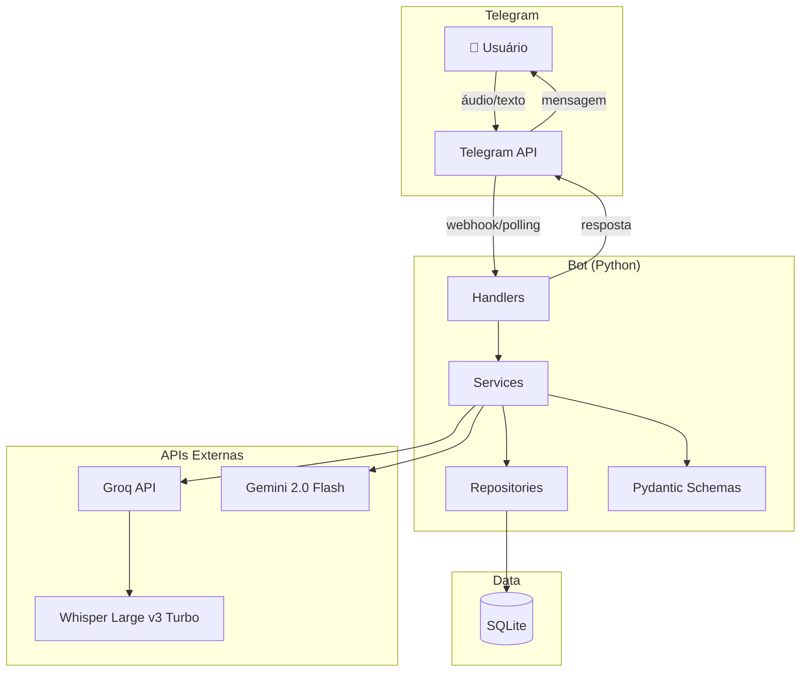
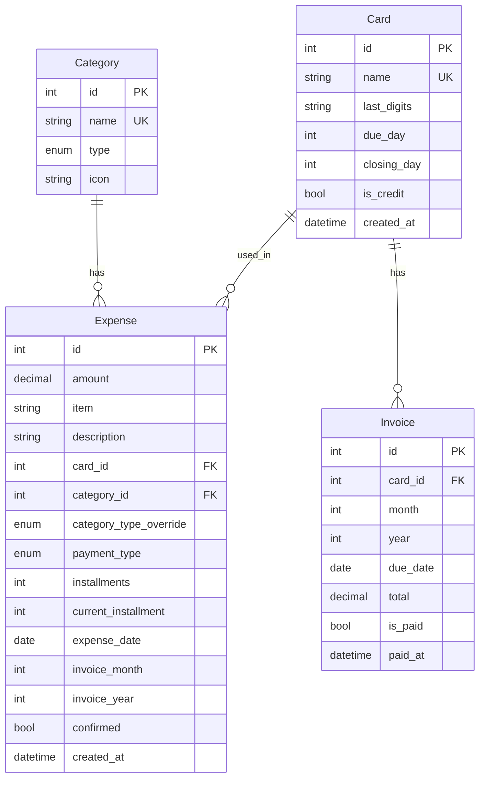

# Tech Specs — Telegram Finance Bot

> **Resumo executivo:** Bot Python com python-telegram-bot 22.x, Groq Whisper Large v3 Turbo (STT) + Gemini 2.0 Flash (LLM), 
> SQLite + SQLAlchemy. Arquitetura em camadas (handlers → services → repositories). 
> Validação com Pydantic. Deploy local via Docker ou direto.

## 1. Arquitetura

### Diagrama



### Componentes

| Componente | Responsabilidade | Tecnologia |
|------------|------------------|------------|
| Handlers | Receber mensagens, callbacks | python-telegram-bot 22.x |
| Services | Lógica de negócio | Python 3.14 |
| Repositories | Acesso a dados | SQLAlchemy 2.x |
| Schemas | Validação de dados | Pydantic 2.x |
| Groq Client | Chamadas STT (Whisper) | groq-sdk |
| Gemini Client | Chamadas LLM (extração) | google-generativeai |
| SQLite | Persistência | SQLite 3.51.x |
| Scheduler | Alertas de vencimento | APScheduler |

## 2. Modelo de Dados

### Entidade: Category

```json
{
  "$schema": "http://json-schema.org/draft-07/schema#",
  "type": "object",
  "properties": {
    "id": { "type": "integer" },
    "name": { "type": "string", "maxLength": 50 },
    "type": { "type": "string", "enum": ["ESSENCIAL", "NAO_ESSENCIAL"] },
    "icon": { "type": "string", "maxLength": 10 }
  },
  "required": ["id", "name", "type", "icon"]
}
```

### Entidade: Card

```json
{
  "$schema": "http://json-schema.org/draft-07/schema#",
  "type": "object",
  "properties": {
    "id": { "type": "integer" },
    "name": { 
      "type": "string", 
      "minLength": 1,
      "maxLength": 50
    },
    "last_digits": { 
      "type": "string", 
      "maxLength": 4,
      "nullable": true
    },
    "due_day": { 
      "type": "integer", 
      "minimum": 1, 
      "maximum": 31 
    },
    "closing_day": { 
      "type": "integer", 
      "minimum": 1, 
      "maximum": 31 
    },
    "is_credit": { "type": "boolean" },
    "created_at": { "type": "string", "format": "date-time" }
  },
  "required": ["id", "name", "due_day", "closing_day", "is_credit"]
}
```

### Entidade: Expense

```json
{
  "$schema": "http://json-schema.org/draft-07/schema#",
  "type": "object",
  "properties": {
    "id": { "type": "integer" },
    "amount": { 
      "type": "number", 
      "minimum": 0.01,
      "x-pii": false
    },
    "item": {
      "type": "string",
      "maxLength": 100,
      "nullable": true,
      "description": "Nome do item específico (ex: cerveja, carne)"
    },
    "description": { 
      "type": "string", 
      "maxLength": 500,
      "nullable": true
    },
    "card_id": { 
      "type": "integer", 
      "nullable": true 
    },
    "category_id": { "type": "integer" },
    "category_type_override": {
      "type": "string",
      "enum": ["ESSENCIAL", "NAO_ESSENCIAL"],
      "nullable": true,
      "description": "Sobrescreve o tipo da categoria baseado no item específico"
    },
    "payment_type": { 
      "type": "string", 
      "enum": ["PIX", "DEBITO", "CREDITO"] 
    },
    "installments": { 
      "type": "integer", 
      "minimum": 1, 
      "maximum": 48,
      "default": 1
    },
    "current_installment": { 
      "type": "integer", 
      "minimum": 1,
      "default": 1
    },
    "expense_date": { "type": "string", "format": "date" },
    "invoice_month": { 
      "type": "integer",
      "minimum": 1,
      "maximum": 12,
      "nullable": true
    },
    "invoice_year": { 
      "type": "integer",
      "nullable": true
    },
    "confirmed": { "type": "boolean", "default": false },
    "created_at": { "type": "string", "format": "date-time" }
  },
  "required": ["id", "amount", "category_id", "payment_type", "expense_date"]
}
```

### Entidade: Invoice

```json
{
  "$schema": "http://json-schema.org/draft-07/schema#",
  "type": "object",
  "properties": {
    "id": { "type": "integer" },
    "card_id": { "type": "integer" },
    "month": { "type": "integer", "minimum": 1, "maximum": 12 },
    "year": { "type": "integer" },
    "due_date": { "type": "string", "format": "date" },
    "total": { "type": "number", "default": 0 },
    "is_paid": { "type": "boolean", "default": false },
    "paid_at": { "type": "string", "format": "date-time", "nullable": true }
  },
  "required": ["id", "card_id", "month", "year", "due_date"]
}
```

### Diagrama ER



## 3. Serviços Internos

### SVC-001: AudioService

Responsável por transcrição de áudio via Groq Whisper.

#### Método: `transcribe(audio_file: bytes) -> str`

| Parâmetro | Tipo | Descrição |
|-----------|------|-----------|
| audio_file | bytes | Arquivo de áudio (ogg/mp3) |

| Retorno | Tipo | Descrição |
|---------|------|-----------|
| text | str | Texto transcrito |

| Erro | Quando | Ação |
|------|--------|------|
| AudioTooLongError | > 60s | Retornar mensagem de erro |
| TranscriptionError | API falhou | Log + retornar mensagem |

**Chamada Groq Whisper:**
```python
from groq import Groq

client = Groq(api_key=GROQ_API_KEY)

transcription = client.audio.transcriptions.create(
    file=("audio.ogg", audio_file),
    model="whisper-large-v3-turbo",
    language="pt",
    response_format="text"
)
```

---

### SVC-002: ExtractionService

Responsável por extrair dados estruturados do texto via Gemini 2.0 Flash.

#### Método: `extract(text: str) -> ExpenseData`

| Parâmetro | Tipo | Descrição |
|-----------|------|-----------|
| text | str | Texto transcrito |

| Retorno | Tipo | Descrição |
|---------|------|-----------|
| ExpenseData | Pydantic | Dados extraídos |

**Schemas de saída:**
```python
from datetime import date
from pydantic import BaseModel
from typing import Literal

class ExpenseItem(BaseModel):
    amount: float | None
    category: str
    category_type: Literal["ESSENCIAL", "NAO_ESSENCIAL"]
    item: str | None = None  # Nome do item específico (cerveja, carne, etc)
    card: str | None = None
    payment_type: Literal["PIX", "DEBITO", "CREDITO"] = "DEBITO"
    installments: int = 1
    expense_date: date
    description: str | None = None

class ExtractionResult(BaseModel):
    """Pode ser um único item ou múltiplos"""
    items: list[ExpenseItem]
    
    @classmethod
    def from_llm_response(cls, data: dict, default_date: date) -> "ExtractionResult":
        if "items" in data:
            items = [ExpenseItem(**item, expense_date=item.get("expense_date", default_date)) for item in data["items"]]
        else:
            items = [ExpenseItem(**data, expense_date=data.get("expense_date", default_date))]
        return cls(items=items)
```

**Prompt do LLM:**
```python
from datetime import date, timedelta

EXTRACTION_PROMPT = """Você é um assistente de extração de dados financeiros pessoais.
Data de hoje: {today}
Dia da semana hoje: {weekday}

Extraia do texto os dados de gastos. Se houver MÚLTIPLOS ITENS com valores separados, retorne um ARRAY.

Para CADA gasto extraia:
- amount: valor em reais (número decimal, null se não encontrado)
- category: uma de [Mercado, Moradia, Contas, Transporte, Saúde, Alimentação, Lazer, Vestuário, Outros]
- category_type: ESSENCIAL ou NAO_ESSENCIAL (baseado no ITEM específico)
- item: nome do item comprado (se mencionado)
- card: nome do cartão (null se não mencionado)
- payment_type: PIX | DEBITO | CREDITO (inferir pelo contexto, default DEBITO)
- installments: número de parcelas (1 se não mencionado)
- expense_date: data no formato YYYY-MM-DD
- description: descrição curta (max 50 chars)

REGRAS DE CLASSIFICAÇÃO DE ITENS:
✅ ESSENCIAL:
- Alimentos básicos: carne, frango, peixe, ovos, arroz, feijão, macarrão, pão
- Hortifruti: frutas, verduras, legumes
- Laticínios: leite, queijo, manteiga, iogurte natural
- Produtos de limpeza e higiene pessoal

❌ NAO_ESSENCIAL:
- Bebidas alcoólicas: cerveja, vinho, whisky, vodka, cachaça
- Bebidas industrializadas: refrigerante, suco de caixa, energético
- Doces e snacks: chocolate, sorvete, salgadinhos, biscoitos recheados

REGRAS DE DATA:
- "hoje" → {today}
- "ontem" → {yesterday}
- "anteontem" → {day_before_yesterday}
- "segunda/terça/quarta/quinta/sexta/sábado/domingo" → último dia dessa semana
- "semana passada" → {today} - 7 dias
- "dia X" → dia X do mês atual (ou anterior se já passou)
- Se NÃO mencionar data → usar {today}

REGRAS DE PAGAMENTO:
- "crédito", "parcelado", "X vezes" → CREDITO
- "débito", "no débito" → DEBITO
- "pix", "transferência" → PIX
- Se não especificado → DEBITO

Texto: "{text}"

Se MÚLTIPLOS ITENS com valores diferentes, retorne: {{ "items": [...] }}
Se ÚNICO gasto, retorne objeto diretamente.
Responda APENAS com JSON válido."""

def _get_weekday_name(self, day: int) -> str:
    days = ["segunda", "terça", "quarta", "quinta", "sexta", "sábado", "domingo"]
    return days[day]

def _calculate_dates(self) -> dict:
    today = date.today()
    return {
        "today": today.isoformat(),
        "yesterday": (today - timedelta(days=1)).isoformat(),
        "day_before_yesterday": (today - timedelta(days=2)).isoformat(),
        "weekday": self._get_weekday_name(today.weekday())
    }

def extract(self, text: str) -> ExtractionResult:
    dates = self._calculate_dates()
    
    response = self.gemini_client.generate_content(
        EXTRACTION_PROMPT.format(text=text, **dates),
        generation_config={
            "temperature": 0.1,
            "max_output_tokens": 500,
            "response_mime_type": "application/json"
        }
    )
    
    data = json.loads(response.text)
    return ExtractionResult.from_llm_response(data, date.today())
```

---

### SVC-003: ExpenseService

Lógica de negócio para gastos.

#### Método: `create_pending(data: ExpenseData) -> Expense`

Cria um gasto pendente (confirmed=false).

#### Método: `confirm(expense_id: int) -> Expense`

Confirma o gasto e calcula fatura se crédito.

#### Método: `cancel(expense_id: int) -> None`

Deleta o gasto pendente.

#### Método: `update_field(expense_id: int, field: str, value: Any) -> Expense`

Atualiza um campo específico do gasto pendente.

---

### SVC-004: InvoiceService

Lógica de cálculo de faturas e distribuição de parcelas.

#### Método: `calculate_first_invoice(card: Card, expense_date: date) -> tuple[int, int]`

Retorna (mês, ano) da PRIMEIRA fatura (parcela 1) baseado na data do gasto e fechamento do cartão.

```python
def calculate_first_invoice(self, card: Card, expense_date: date) -> tuple[int, int]:
    """
    Regras:
    - Compra ATÉ o dia do fechamento (inclusive) → fatura ATUAL
    - Compra APÓS o dia do fechamento → PRÓXIMA fatura
    
    Exemplo:
    - Cartão fecha dia 20
    - Compra dia 15 → fatura do mês atual
    - Compra dia 20 → fatura do mês atual
    - Compra dia 21 → fatura do próximo mês
    """
    if expense_date.day <= card.closing_day:
        # Fatura atual (mesmo mês)
        return (expense_date.month, expense_date.year)
    else:
        # Próxima fatura
        if expense_date.month == 12:
            return (1, expense_date.year + 1)
        return (expense_date.month + 1, expense_date.year)
```

#### Método: `distribute_installments(expense: Expense, card: Card) -> list[Expense]`

Distribui parcelas nas faturas corretas, começando pela parcela 1.

```python
from decimal import Decimal, ROUND_DOWN
from dateutil.relativedelta import relativedelta

def distribute_installments(self, expense: Expense, card: Card) -> list[Expense]:
    """
    Distribui parcelas:
    - Parcela 1: fatura calculada por calculate_first_invoice()
    - Parcela 2: mês seguinte à parcela 1
    - Parcela 3: mês seguinte à parcela 2
    - ... e assim por diante
    
    Arredondamento:
    - Valor base: total / parcelas (arredondado para baixo em centavos)
    - Última parcela: recebe a diferença para fechar o total
    """
    installments = []
    total = Decimal(str(expense.amount))
    num_installments = expense.installments
    
    # Calcula valor base (arredondado para baixo)
    base_value = (total / num_installments).quantize(Decimal('0.01'), rounding=ROUND_DOWN)
    
    # Calcula fatura da primeira parcela
    first_month, first_year = self.calculate_first_invoice(card, expense.expense_date)
    
    for i in range(num_installments):
        # Calcula mês/ano desta parcela
        invoice_date = date(first_year, first_month, 1) + relativedelta(months=i)
        
        # Última parcela recebe diferença de arredondamento
        if i == num_installments - 1:
            value = total - (base_value * (num_installments - 1))
        else:
            value = base_value
        
        installment = Expense(
            amount=float(value),
            item=expense.item,
            description=expense.description,
            card_id=expense.card_id,
            category_id=expense.category_id,
            category_type_override=expense.category_type_override,
            payment_type=expense.payment_type,
            installments=num_installments,
            current_installment=i + 1,  # 1-indexed
            expense_date=expense.expense_date,
            invoice_month=invoice_date.month,
            invoice_year=invoice_date.year,
            confirmed=expense.confirmed,
        )
        installments.append(installment)
    
    return installments
```

#### Método: `calculate_invoice_due_date(card: Card, month: int, year: int) -> date`

Calcula a data de vencimento de uma fatura.

```python
def calculate_invoice_due_date(self, card: Card, month: int, year: int) -> date:
    """
    Retorna a data de vencimento da fatura (dia do vencimento no mês/ano).
    """
    return date(year, month, card.due_day)
```

#### Exemplo de Uso

```python
# Compra: R$ 100 em 3x, dia 25/01/2026
# Cartão: fecha dia 20, vence dia 28

expense = Expense(amount=100.00, installments=3, expense_date=date(2026, 1, 25), ...)
card = Card(closing_day=20, due_day=28, ...)

# 25 > 20, então parcela 1 vai para FEVEREIRO
installments = invoice_service.distribute_installments(expense, card)

# Resultado:
# [
#   Expense(amount=33.33, current_installment=1, invoice_month=2, invoice_year=2026),  # FEV
#   Expense(amount=33.33, current_installment=2, invoice_month=3, invoice_year=2026),  # MAR
#   Expense(amount=33.34, current_installment=3, invoice_month=4, invoice_year=2026),  # ABR (centavo extra)
# ]
```

---

### SVC-005: AlertService

Scheduler para alertas de vencimento.

#### Método: `check_due_invoices() -> list[Invoice]`

Executado diariamente às 9h. Retorna faturas que vencem em 3 dias ou hoje.

---

## 4. Handlers do Telegram

### HDL-001: CommandHandler

| Comando | Handler | Service |
|---------|---------|---------|
| /start | `start_handler` | - |
| /ajuda | `help_handler` | - |
| /resumo | `summary_handler` | ExpenseService |
| /cartoes | `cards_handler` | CardService |
| /faturas | `invoices_handler` | InvoiceService |
| /categorias | `categories_handler` | CategoryService |

### HDL-002: MessageHandler (Áudio)

```python
async def audio_handler(update: Update, context: ContextTypes.DEFAULT_TYPE):
    # 1. Validar OWNER_ID
    if update.effective_user.id != OWNER_TELEGRAM_ID:
        return  # Ignorar silenciosamente
    
    # 2. Baixar áudio
    voice = update.message.voice
    if voice.duration > 60:
        await update.message.reply_text("❌ Áudio muito longo. Máximo 60 segundos.")
        return
    
    file = await voice.get_file()
    audio_bytes = await file.download_as_bytearray()
    
    # 3. Transcrever
    text = await audio_service.transcribe(audio_bytes)
    
    # 4. Extrair dados
    expense_data = await extraction_service.extract(text)
    
    # 5. Criar pendente
    expense = await expense_service.create_pending(expense_data)
    
    # 6. Mostrar preview
    await show_preview(update, expense)
```

### HDL-003: CallbackQueryHandler

```python
async def callback_handler(update: Update, context: ContextTypes.DEFAULT_TYPE):
    query = update.callback_query
    data = query.data
    
    if data.startswith("confirm_"):
        expense_id = int(data.split("_")[1])
        await expense_service.confirm(expense_id)
        await query.answer("✅ Registrado!")
        
    elif data.startswith("cancel_"):
        expense_id = int(data.split("_")[1])
        await expense_service.cancel(expense_id)
        await query.answer("❌ Cancelado")
        
    elif data.startswith("edit_"):
        # Mostrar menu de edição
        pass
```

## 5. Integrações Externas

| Integração | Tipo | Timeout | Retries | Fallback |
|------------|------|---------|---------|----------|
| Groq Whisper | REST API | 30s | 2 | Mensagem de erro |
| Gemini Flash | REST API | 30s | 2 | Mensagem de erro |
| Telegram API | REST/Polling | 60s | 3 | Log + retry |

### Configuração APIs de IA

```python
# config.py
import os

# Groq (Speech-to-Text)
GROQ_API_KEY = os.getenv("GROQ_API_KEY")
GROQ_WHISPER_MODEL = "whisper-large-v3-turbo"
GROQ_TIMEOUT = 30
GROQ_MAX_RETRIES = 2

# Google AI (Gemini)
GOOGLE_API_KEY = os.getenv("GOOGLE_API_KEY")
GEMINI_MODEL = "gemini-2.0-flash"
GEMINI_TIMEOUT = 30
GEMINI_MAX_RETRIES = 2
```

## 6. Estrutura de Diretórios

```
telegram-finance-bot/
├── src/
│   ├── __init__.py
│   ├── main.py                     # Entry point
│   ├── config.py                   # Configurações
│   │
│   ├── handlers/                   # Telegram handlers
│   │   ├── __init__.py
│   │   ├── commands.py             # /start, /resumo, etc
│   │   ├── audio.py                # Processamento de áudio
│   │   └── callbacks.py            # Inline buttons
│   │
│   ├── services/                   # Lógica de negócio
│   │   ├── __init__.py
│   │   ├── audio_service.py        # Transcrição
│   │   ├── extraction_service.py   # Extração LLM
│   │   ├── expense_service.py      # CRUD gastos
│   │   ├── card_service.py         # CRUD cartões
│   │   ├── invoice_service.py      # Cálculo faturas
│   │   └── alert_service.py        # Alertas
│   │
│   ├── repositories/               # Acesso a dados
│   │   ├── __init__.py
│   │   ├── base.py                 # Repository base
│   │   ├── expense_repo.py
│   │   ├── card_repo.py
│   │   ├── category_repo.py
│   │   └── invoice_repo.py
│   │
│   ├── models/                     # SQLAlchemy models
│   │   ├── __init__.py
│   │   ├── base.py                 # Base model
│   │   ├── expense.py
│   │   ├── card.py
│   │   ├── category.py
│   │   └── invoice.py
│   │
│   ├── schemas/                    # Pydantic schemas
│   │   ├── __init__.py
│   │   ├── expense.py
│   │   ├── card.py
│   │   └── extraction.py
│   │
│   └── utils/
│       ├── __init__.py
│       ├── groq_client.py          # Cliente Groq (Whisper STT)
│       ├── gemini_client.py        # Cliente Google AI (Gemini)
│       └── formatters.py           # Formatação de mensagens
│
├── migrations/                     # Alembic
│   ├── env.py
│   └── versions/
│       └── 001_initial.py
│
├── tests/
│   ├── __init__.py
│   ├── conftest.py                 # Fixtures
│   ├── test_audio_service.py
│   ├── test_extraction_service.py
│   ├── test_expense_service.py
│   └── test_invoice_service.py
│
├── data/                           # SQLite database
│   └── .gitkeep
│
├── .env.example
├── .gitignore
├── alembic.ini
├── pyproject.toml
├── README.md
└── Dockerfile
```

## 7. Variáveis de Ambiente

```env
# .env.example

# === Telegram ===
TELEGRAM_BOT_TOKEN=your_bot_token_here
OWNER_TELEGRAM_ID=your_telegram_id_here

# === Groq (Speech-to-Text) ===
GROQ_API_KEY=your_groq_api_key_here

# === Google AI (Gemini) ===
GOOGLE_API_KEY=your_google_api_key_here

# === Database ===
DATABASE_URL=sqlite:///./data/finance.db

# === App ===
LOG_LEVEL=INFO
ENVIRONMENT=development

# === Alertas ===
ALERT_HOUR=9
ALERT_DAYS_BEFORE=3
```

## 8. Dependências

```toml
# pyproject.toml
[project]
name = "telegram-finance-bot"
version = "1.0.0"
requires-python = ">=3.10"

dependencies = [
    "python-telegram-bot[job-queue]>=22.0",
    "groq>=0.4.0",
    "google-generativeai>=0.8.0",
    "sqlalchemy>=2.0",
    "alembic>=1.18",
    "pydantic>=2.12",
    "pydantic-settings>=2.1",
    "python-dotenv>=1.2",
    "apscheduler>=3.10",
    "httpx>=0.26",
]

[project.optional-dependencies]
dev = [
    "pytest>=8.0",
    "pytest-asyncio>=0.23",
    "pytest-cov>=4.1",
    "ruff>=0.1",
]
```

## 9. Estratégia de Testes

### Cobertura por Feature

| FEAT | TEST IDs | Tipo | Cenários |
|------|----------|------|----------|
| FEAT-001 | TEST-001 a TEST-004 | unit | Transcrição válida, longa, erro API |
| FEAT-002 | TEST-005 a TEST-010, TEST-039 a TEST-044 | unit | Extração completa, parcial, múltiplos itens, datas relativas |
| FEAT-003 | TEST-011 a TEST-015 | unit, integration | Preview, confirm, cancel, timeout, múltiplos itens |
| FEAT-004 | TEST-016 a TEST-019 | unit | Edição de campos |
| FEAT-005 | TEST-020 a TEST-024 | unit | CRUD cartões |
| FEAT-006 | TEST-025 a TEST-027 | unit | Cálculo de parcelas |
| FEAT-007 | TEST-028 a TEST-031 | unit | Alertas |
| FEAT-008 | TEST-032 a TEST-034 | integration | Resumo |

### Testes de Múltiplos Itens e Datas (FEAT-002)

| TEST ID | Cenário | Input | Expected Output |
|---------|---------|-------|-----------------|
| TEST-039 | Múltiplos itens mesma compra | "20 de cerveja e 15 de carne no mercado" | 2 ExpenseItems |
| TEST-040 | Classificação cerveja | "cerveja" | category_type: NAO_ESSENCIAL |
| TEST-040 | Classificação carne | "carne" | category_type: ESSENCIAL |
| TEST-041 | Data "ontem" | "gastei 50 ontem" | expense_date: today - 1 |
| TEST-042 | Data dia da semana | "comprei na segunda" (hoje quarta) | expense_date: última segunda |
| TEST-043 | Data "anteontem" | "paguei anteontem" | expense_date: today - 2 |
| TEST-044 | Sem data | "gastei 100 no mercado" | expense_date: today |

### Fixtures

```python
# tests/conftest.py
import pytest
from src.models import Category, Card

@pytest.fixture
def categories():
    return [
        Category(id=1, name="Mercado", type="ESSENCIAL", icon="🛒"),
        Category(id=2, name="Alimentação", type="NAO_ESSENCIAL", icon="🍔"),
    ]

@pytest.fixture
def cards():
    return [
        Card(id=1, name="Nubank", due_day=10, closing_day=3, is_credit=True),
        Card(id=2, name="Inter", due_day=15, closing_day=8, is_credit=True),
    ]

@pytest.fixture
def mock_groq_client(mocker):
    client = mocker.Mock()
    client.audio.transcriptions.create.return_value.text = "gastei 100 reais no mercado"
    return client
```

## 10. Matriz de Rastreabilidade

| FEAT | RULE | SVC | HDL | TEST |
|------|------|-----|-----|------|
| FEAT-001 | RULE-001, RULE-002, RULE-003 | SVC-001 | HDL-002 | TEST-001 a TEST-004 |
| FEAT-002 | RULE-004 a RULE-008, RULE-029 a RULE-032 | SVC-002 | HDL-002 | TEST-005 a TEST-010, TEST-039 a TEST-044 |
| FEAT-003 | RULE-009 a RULE-012 | SVC-003 | HDL-003 | TEST-011 a TEST-015 |
| FEAT-004 | RULE-013 a RULE-016 | SVC-003 | HDL-003 | TEST-016 a TEST-019 |
| FEAT-005 | RULE-017 a RULE-019 | CardService | HDL-001 | TEST-020 a TEST-024 |
| FEAT-006 | RULE-020 a RULE-022 | SVC-004 | - | TEST-025 a TEST-027 |
| FEAT-007 | RULE-023 a RULE-025 | SVC-005 | - | TEST-028 a TEST-031 |
| FEAT-008 | RULE-026 a RULE-028 | SVC-003 | HDL-001 | TEST-032 a TEST-034 |

## 11. Mapa de Erros Consolidado

| Code | HTTP | Quando | Mensagem | Ação |
|------|------|--------|----------|------|
| AUDIO.TOO_LONG | - | > 60s | "❌ Áudio muito longo. Máximo 60 segundos." | Rejeitar |
| AUDIO.TRANSCRIPTION_FAILED | 503 | Groq Whisper falhou | "❌ Erro ao transcrever. Tente novamente." | Log + retry |
| EXPENSE.EXTRACTION_FAILED | 503 | Gemini falhou | "❌ Erro ao processar. Tente novamente." | Log + retry |
| EXPENSE.MISSING_AMOUNT | - | Sem valor | "💰 Qual foi o valor?" | Solicitar |
| EXPENSE.MISSING_CARD | - | Crédito sem cartão | "💳 Qual cartão foi usado?" | Solicitar |
| EXPENSE.TIMEOUT | - | 5 min sem resposta | "⏰ Tempo expirado." | Deletar pendente |
| EXPENSE.INCOMPREHENSIBLE | - | Texto sem sentido | "❓ Não entendi." | Solicitar novo |
| VALIDATION.* | 400 | Validação falhou | Específico por campo | Solicitar correção |
| CARD.LIMIT_REACHED | - | > 10 cartões | "❌ Limite de 10 cartões." | Rejeitar |
| CARD.NAME_TAKEN | 409 | Nome duplicado | "❌ Já existe um cartão com este nome." | Rejeitar |
| INTERNAL.ERROR | 500 | Erro inesperado | "❌ Erro interno." | Log + alerta |

## 12. Comandos de Desenvolvimento

```bash
# Instalar dependências
pip install -e ".[dev]"

# Rodar migrações
alembic upgrade head

# Rodar bot (desenvolvimento)
python -m src.main

# Rodar testes
pytest

# Rodar testes com cobertura
pytest --cov=src --cov-report=html

# Lint
ruff check src tests
ruff format src tests

# Docker
docker build -t telegram-finance-bot .
docker run --env-file .env telegram-finance-bot
```
